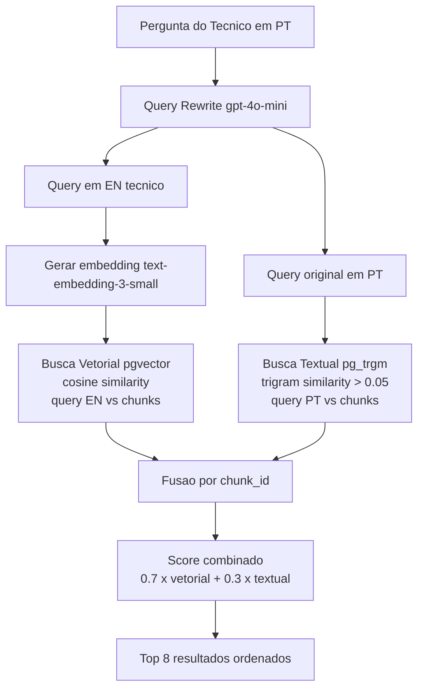

# ADR-003 — Estrategia de Busca Hibrida para RAG

| Campo        | Valor                                       |
|--------------|---------------------------------------------|
| **Data**     | 2026-02-20                                  |
| **Status**   | Aceita                                      |
| **Autor**    | HaruCode (Equipe Kyotech AI)                |
| **Jira**     | IA-65                                       |
| **Relacao**  | Complementa ADR-001 (infraestrutura Azure)  |

---

## 1. Contexto

O Kyotech AI e um sistema RAG para consulta de manuais tecnicos Fujifilm. Os tecnicos de campo fazem perguntas em portugues que envolvem dois tipos de informacao:

1. **Semantica:** "Como trocar o rolo de pressao?" — requer compreensao do significado
2. **Exata:** "Erro E-045", "Peca 116-1234", "SOP 7.3.2" — requer correspondencia exata de codigos, numeros de pecas e referencias

Uma busca puramente vetorial (semantica) perde codigos e numeros exatos. Uma busca puramente textual perde o significado e contexto das perguntas. Os manuais sao predominantemente em ingles, mas os tecnicos perguntam em portugues.

A estrategia de busca precisa:
- Funcionar com queries em portugues contra documentos em ingles
- Capturar tanto significado semantico quanto termos exatos
- Operar dentro do banco de dados PostgreSQL existente (sem servicos adicionais)
- Ter latencia aceitavel para uso interativo (<5s)

---

## 2. Decisao

**Adotar busca hibrida combinando pgvector (similaridade coseno) e pg_trgm (similaridade de trigramas), com fusao ponderada 70/30.**

### Arquitetura da busca

### Implementacao (`backend/app/services/search.py`)

| Componente | Detalhe |
|------------|---------|
| **Busca vetorial** | Embedding da query EN via `text-embedding-3-small` → `1 - (embedding <=> query_embedding)` via pgvector |
| **Busca textual** | `similarity(content, query_pt)` via pg_trgm com threshold `> 0.05` |
| **Fusao** | Merge por `chunk_id`: score = `(sim_vetorial * 0.7) + (sim_textual * 0.3)` |
| **Deduplicacao** | Chunks presentes em ambas as buscas sao marcados como `search_type: "hybrid"` |
| **Limite** | Top 8 resultados ordenados por score combinado |
| **Filtros** | Opcionais por `doc_type` e `equipment_key` |
| **Versoes** | JOIN com view `current_versions` para buscar apenas versoes mais recentes |

### Estrategia de idioma

- **Query rewrite** (gpt-4o-mini): traduz PT→EN para melhor match com manuais em ingles
- **Busca vetorial**: usa query em **ingles** (embeddings capturam significado cross-lingual, mas melhor match com docs EN)
- **Busca textual**: usa query **original em portugues** (captura codigos, numeros exatos que nao mudam entre idiomas)

---

## 3. Alternativas Consideradas

### 3a. Busca vetorial apenas (pgvector)

| Aspecto | Avaliacao |
|---------|-----------|
| Qualidade semantica | Alta — embeddings capturam significado e contexto |
| Termos exatos | Fraca — "Erro E-045" pode retornar chunks sobre "erros" em geral |
| Complexidade | Baixa — unica query SQL |
| Infraestrutura | Apenas pgvector (ja necessario) |

**Motivo de rejeicao:** Manuais tecnicos Fujifilm contem muitos codigos de pecas, numeros de erro e referencias que precisam de correspondencia exata. Em testes, a busca vetorial sozinha retornava chunks irrelevantes para queries com codigos especificos.

### 3b. BM25 (full-text search via PostgreSQL tsvector)

| Aspecto | Avaliacao |
|---------|-----------|
| Qualidade semantica | Nenhuma — busca puramente lexical baseada em frequencia de termos |
| Termos exatos | Boa — especialmente com dicionario de stemming |
| Complexidade | Baixa — tsvector/tsquery nativos do PostgreSQL |
| Idioma | Requer configuracao de dicionario por idioma (problematico para manuais bilingues) |

**Motivo de rejeicao:** Sem componente semantico. A combinacao com vetorial seria valida, mas `pg_trgm` se mostrou mais eficaz para correspondencia parcial de codigos e numeros de pecas (que frequentemente nao se beneficiam de stemming).

### 3c. Elasticsearch / OpenSearch (externo)

| Aspecto | Avaliacao |
|---------|-----------|
| Qualidade semantica | Alta — suporta KNN com vetores + BM25 nativo |
| Termos exatos | Excelente — BM25 + analyzers customizados |
| Complexidade | Alta — servico adicional para gerenciar, indexar e sincronizar |
| Custo | Significativo — instancia dedicada (ex: Azure Cognitive Search a partir de ~$250/mes) |
| Infraestrutura | Requer servico externo alem do PostgreSQL |

**Motivo de rejeicao:** Overhead operacional e custo nao justificados para o MVP (<50 usuarios, <1000 documentos). Adiciona complexidade de sincronizacao entre PostgreSQL e indice externo.

### 3d. Pinecone / Weaviate (vector database dedicado)

| Aspecto | Avaliacao |
|---------|-----------|
| Qualidade semantica | Alta — otimizado para busca vetorial |
| Termos exatos | Limitada — metadados filtrados, mas sem busca textual robusta |
| Complexidade | Media — API simples, mas requer sincronizacao com PostgreSQL |
| Custo | Variavel — Pinecone free tier limitado; Pro a partir de $70/mes |
| Infraestrutura | Servico SaaS externo |

**Motivo de rejeicao:** Duplicacao de dados (chunks no PostgreSQL + vetores no Pinecone). Custo adicional. Nao resolve a busca textual sem servico complementar.

---

## 4. Consequencias

### Positivas

- **Banco unico:** Toda a busca (vetorial + textual) acontece no PostgreSQL — sem servicos adicionais para gerenciar, sincronizar ou pagar
- **Melhor cobertura:** Queries semanticas e queries com codigos exatos sao atendidas na mesma busca
- **Latencia aceitavel:** Duas queries SQL paralelas (vetorial + textual) + fusao em memoria — tipicamente <2s
- **Simplicidade operacional:** pgvector e pg_trgm sao extensoes nativas do PostgreSQL, sem dependencias externas
- **Peso configuravel:** A ponderacao 70/30 pode ser ajustada sem alterar infraestrutura
- **Rastreabilidade:** Cada resultado indica `search_type` (vector/text/hybrid), permitindo analise de qualidade

### Negativas

- **Escala limitada:** Para milhoes de chunks, pgvector com busca exata pode ter latencia elevada (mitigavel com indices IVFFlat ou HNSW)
- **pg_trgm nao e BM25:** Trigram similarity e menos sofisticada que BM25 para busca textual de documentos longos
- **Fusao simplificada:** A fusao por score ponderado nao e tao sofisticada quanto Reciprocal Rank Fusion (RRF) — pode ser melhorada no futuro
- **Duas queries:** A busca hibrida executa duas queries sequenciais (vetorial + textual), dobrando a carga no banco

### Riscos Mitigados

| Risco | Mitigacao |
|-------|-----------|
| Latencia com crescimento de dados | Criar indice HNSW no pgvector e indice GIN para pg_trgm |
| Ponderacao inadequada | Monitorar taxa de relevancia; ajustar pesos 70/30 com base em feedback |
| pg_trgm insuficiente | Possibilidade de migrar busca textual para tsvector/BM25 sem alterar arquitetura |
| Queries em portugues contra docs EN | Query rewrite via gpt-4o-mini traduz para EN antes da busca vetorial |

---

## 5. Referencias

- Implementacao: `backend/app/services/search.py`
- pgvector: https://github.com/pgvector/pgvector
- pg_trgm: https://www.postgresql.org/docs/current/pgtrgm.html
- Query rewrite: `backend/app/services/query_rewriter.py`
- Card Jira: IA-65
