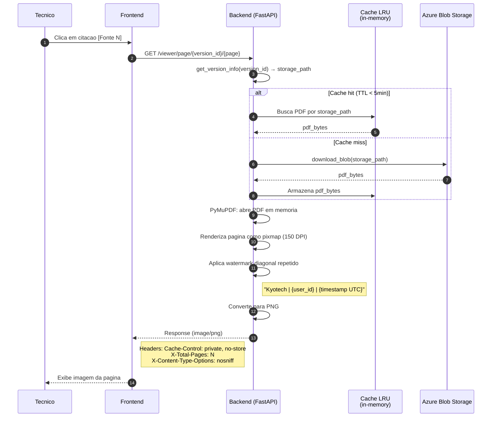

# ADR-004 — Viewer Seguro de PDF com Render Server-Side

| Campo        | Valor                                       |
|--------------|---------------------------------------------|
| **Data**     | 2026-03-01                                  |
| **Status**   | Aceita                                      |
| **Autor**    | HaruCode (Equipe Kyotech AI)                |
| **Jira**     | IA-65                                       |
| **Relacao**  | Depende de ADR-001 (Azure Blob Storage)     |

---

## 1. Contexto

O Kyotech AI armazena manuais tecnicos proprietarios da Fujifilm no Azure Blob Storage. Esses documentos contem informacoes confidenciais (procedimentos de manutencao, diagramas, especificacoes de pecas) que **nao devem ser compartilhados** fora da organizacao.

Os tecnicos de campo precisam visualizar paginas especificas dos manuais (apontadas pelas citacoes do chat RAG), mas o sistema deve:

1. **Impedir download do PDF original** — nenhum arquivo PDF ou URL direta deve ser exposto ao navegador
2. **Rastrear acesso** — se uma imagem de pagina for compartilhada externamente, deve ser possivel identificar quem a visualizou
3. **Manter usabilidade** — a visualizacao deve ser rapida o suficiente para navegacao interativa entre paginas
4. **Proteger storage_path** — o caminho do blob no Azure Storage nao deve ser exposto ao frontend

---

## 2. Decisao

**Adotar renderizacao server-side de paginas de PDF como imagens PNG com watermark dinamico, servidas via proxy no backend.**

### Arquitetura do viewer

### Implementacao

| Componente | Arquivo | Detalhes |
|------------|---------|----------|
| **API** | `backend/app/api/viewer.py` | Router `/viewer` com endpoints `GET /info/{version_id}` e `GET /page/{version_id}/{page_number}` |
| **Render** | `backend/app/services/viewer.py` | `render_page_as_image()` — PyMuPDF para render + watermark |
| **Cache** | `backend/app/api/viewer.py` | `OrderedDict` LRU (max 10 PDFs, TTL 5min) |

### Parametros de render

| Parametro | Valor | Justificativa |
|-----------|-------|---------------|
| **DPI** | 150 | Boa qualidade de leitura sem gerar imagens excessivamente grandes |
| **Watermark opacity** | 0.06 | Sutil o suficiente para nao atrapalhar leitura, visivel em inspecao |
| **Watermark font size** | 11pt | Legivel mas discreto |
| **Watermark cor** | RGB(0.5, 0.5, 0.5) — cinza medio | Neutro, visivel em fundos claros e escuros |
| **Watermark angulo** | -30 graus (diagonal) | Padrao da industria para watermarks de seguranca |
| **Watermark repeticao** | Grid de 280x140px | Cobre toda a pagina uniformemente |
| **Watermark conteudo** | `"Kyotech \| {user_id} \| {YYYY-MM-DD HH:MM UTC}"` | Rastreabilidade: identifica quem e quando visualizou |

### Headers de seguranca

| Header | Valor | Proposito |
|--------|-------|-----------|
| `Cache-Control` | `private, no-store, max-age=0` | Impede cache do navegador e proxies |
| `X-Content-Type-Options` | `nosniff` | Impede browser de interpretar como outro tipo |
| `Content-Type` | `image/png` | Imagem, nao PDF |

### Cache LRU server-side

| Parametro | Valor | Justificativa |
|-----------|-------|---------------|
| **Tamanho maximo** | 10 PDFs | Limita uso de memoria do servidor |
| **TTL** | 5 minutos | Suficiente para navegacao entre paginas de um documento |
| **Estrategia** | `OrderedDict` com `move_to_end` + eviction do mais antigo | LRU simples sem dependencias externas |

---

## 3. Alternativas Consideradas

### 3a. SAS URL direta (Azure Blob Storage)

| Aspecto | Avaliacao |
|---------|-----------|
| Seguranca | Fraca — URL temporaria (ex: 1h) permite download completo do PDF |
| Rastreabilidade | Nenhuma — impossivel saber quem compartilhou a URL |
| Latencia | Muito baixa — redirect direto para o blob |
| Complexidade | Muito baixa — `generate_sas_token()` nativo do Azure SDK |
| Protecao do PDF | Nenhuma — PDF original e exposto ao navegador |

**Motivo de rejeicao:** Mesmo com TTL curto, qualquer usuario pode baixar o PDF completo e compartilhar. Nao ha watermark nem rastreabilidade. Violaria requisito de protecao de propriedade intelectual da Fujifilm.

### 3b. DRM (Digital Rights Management)

| Aspecto | Avaliacao |
|---------|-----------|
| Seguranca | Alta — controle granular de acesso, copia e impressao |
| Rastreabilidade | Alta — logs de acesso integrados |
| Latencia | Variavel — depende do servico DRM |
| Complexidade | Muito alta — integracao com servico DRM, SDK no frontend, gestao de licencas |
| Custo | Alto — servicos DRM sao tipicamente caros (ex: Adobe Experience Manager) |

**Motivo de rejeicao:** Complexidade e custo desproporcionais para um MVP com <50 usuarios. Requer SDK no frontend e gestao de licencas. Overengineering para o escopo atual.

### 3c. PDF.js no frontend com watermark client-side

| Aspecto | Avaliacao |
|---------|-----------|
| Seguranca | Media — PDF e enviado ao navegador, watermark aplicado via canvas |
| Rastreabilidade | Fraca — watermark pode ser removido inspecionando o canvas ou interceptando a requisicao |
| Latencia | Baixa — render no client, sem processamento server-side |
| Complexidade | Media — configuracao de PDF.js + overlay de watermark em canvas |
| Protecao do PDF | Fraca — PDF completo trafega para o navegador (inspecionavel no Network tab) |

**Motivo de rejeicao:** O PDF original chega ao navegador, sendo interceptavel via DevTools. O watermark client-side pode ser removido. Nao atende ao requisito de "zero exposicao do PDF".

---

## 4. Consequencias

### Positivas

- **Zero exposicao do PDF:** Nenhum arquivo PDF, SAS URL ou storage_path e exposto ao frontend — apenas imagens PNG sao retornadas
- **Rastreabilidade total:** Cada imagem carrega watermark com `user_id` e timestamp — se vazada, e possivel identificar a origem
- **Simplicidade de frontend:** O frontend apenas exibe imagens `` — sem SDK de PDF, sem viewer complexo
- **Sem dependencias externas:** PyMuPDF e uma biblioteca Python pura, sem servicos SaaS adicionais
- **Protecao de copia:** Copiar texto do PDF e impossivel (apenas imagem rasterizada)

### Negativas

- **Latencia maior:** Cada pagina requer download do PDF (ou cache hit) + render + watermark + conversao PNG — tipicamente ~1-3s por pagina
- **Uso de memoria:** Cache LRU mantem ate 10 PDFs em memoria do servidor
- **Sem busca no viewer:** Como a pagina e uma imagem, o usuario nao pode usar Ctrl+F para buscar texto
- **Sem selecao de texto:** Tecnico nao pode copiar trechos do manual (trade-off de seguranca vs usabilidade)
- **Sem zoom semantico:** Zoom e apenas interpolacao de imagem (150 DPI e suficiente para leitura, mas nao para detalhes finos)

### Riscos Mitigados

| Risco | Mitigacao |
|-------|-----------|
| Latencia perceptivel ao navegar | Cache LRU de 5min evita re-download do PDF ao navegar entre paginas |
| Memoria excessiva do servidor | Limite de 10 PDFs no cache; TTL de 5min para eviction automatica |
| Screenshot da imagem | Watermark com user_id + timestamp permite rastreabilidade mesmo em screenshots |
| Storage_path exposto | Endpoint usa `version_id` (UUID); storage_path e resolvido internamente no backend |
| Cache do navegador | Headers `Cache-Control: private, no-store` impedem cache client-side |

---

## 5. Referencias

- Implementacao viewer: `backend/app/services/viewer.py`
- Implementacao API: `backend/app/api/viewer.py`
- PyMuPDF: https://pymupdf.readthedocs.io/
- Card Jira: IA-65, IA-80
