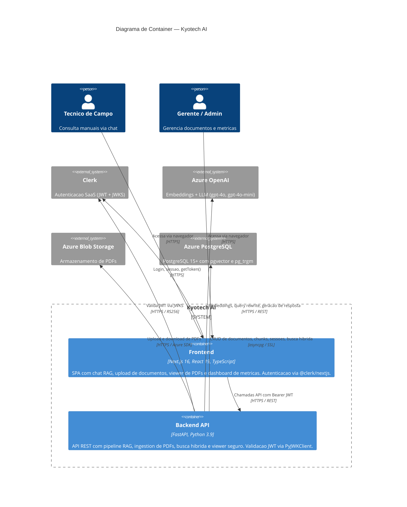

# C4 — Diagrama de Container: Kyotech AI

| Campo        | Valor                                       |
|--------------|---------------------------------------------|
| **Data**     | 2026-03-09                                  |
| **Autor**    | HaruCode (Equipe Kyotech AI)                |
| **Jira**     | IA-61                                       |

---

## Visao Geral

O diagrama de container detalha os componentes internos do sistema Kyotech AI e suas interacoes com sistemas externos, incluindo protocolos de comunicacao.

---

## Diagrama

---

## Detalhamento dos Containers

### Frontend

| Aspecto | Detalhe |
|---------|---------|
| **Tecnologia** | Next.js 16 + React 19 + TypeScript |
| **Autenticacao** | `@clerk/nextjs` com `ClerkProvider`, `<SignIn />`, `<UserButton />` |
| **Localizacao** | `@clerk/localizations` (pt-BR) |
| **Protecao de rotas** | `clerkMiddleware()` no middleware do Next.js |
| **Comunicacao com Backend** | Bearer JWT via `getToken()` do Clerk em headers `Authorization` |

#### Paginas principais

- **Chat RAG** — Interface de perguntas e respostas com citacoes clicaveis
- **Viewer de PDF** — Visualizacao segura de paginas renderizadas como imagem (PNG)
- **Upload** — Formulario para Admin carregar novos manuais PDF
- **Dashboard** — Metricas de equipamentos, documentos e chunks (Admin)
- **Sessoes** — Listagem e gerenciamento de historico de conversas

### Backend API

| Aspecto | Detalhe |
|---------|---------|
| **Tecnologia** | FastAPI + Python 3.9 |
| **Autenticacao** | `PyJWT` + `PyJWKClient` validando JWKS do Clerk (RS256) |
| **RBAC** | `get_current_user()` e `require_role()` como dependencies FastAPI |
| **Banco de dados** | `SQLAlchemy` async + `asyncpg` com SSL |

#### Routers da API

| Router | Prefixo | Descricao |
|--------|---------|-----------|
| **Chat** | `/chat` | `POST /chat/ask` — pipeline RAG completo |
| **Upload** | `/upload` | `POST /upload/document` — ingestion de PDFs (Admin) |
| **Sessions** | `/sessions` | CRUD de sessoes de chat |
| **Viewer** | `/viewer` | `GET /viewer/page/{version_id}/{page}` — render de PDF como PNG |

#### Servicos internos

| Servico | Responsabilidade |
|---------|-----------------|
| `query_rewriter` | Traduz query PT→EN via gpt-4o-mini, classifica tipo de documento |
| `search` | Busca hibrida: vetorial (pgvector, cosine) + textual (pg_trgm, trigram) com fusao 70/30 |
| `generator` | Gera resposta em PT com citacoes `[Fonte N]` via gpt-4o |
| `ingestion` | Pipeline de 6 etapas: extrair texto, equipamento, documento, upload blob, versao, chunks+embeddings |
| `viewer` | Renderiza pagina de PDF como PNG com watermark dinamico (user_id + timestamp) |
| `pdf_extractor` | Extrai texto de PDFs via PyMuPDF, calcula SHA-256 |
| `embedder` | Gera embeddings via Azure OpenAI (text-embedding-3-small) |
| `storage` | Upload/download de blobs no Azure Blob Storage |
| `repository` | CRUD de equipamentos, documentos, versoes e chunks no PostgreSQL |
| `chat_repository` | CRUD de sessoes e mensagens de chat |

### Banco de Dados (Azure PostgreSQL)

| Aspecto | Detalhe |
|---------|---------|
| **Versao** | PostgreSQL 15+ |
| **Extensoes** | `pgvector` (busca vetorial), `pg_trgm` (busca por trigramas) |
| **Conexao** | `asyncpg` com SSL obrigatorio |
| **Tabelas principais** | `equipments`, `documents`, `document_versions`, `chunks`, `chat_sessions`, `chat_messages` |
| **View** | `current_versions` — versao mais recente de cada documento |

---

## Protocolos de Comunicacao

| Origem | Destino | Protocolo | Detalhes |
|--------|---------|-----------|----------|
| Navegador | Frontend | HTTPS | Aplicacao SPA servida via Next.js |
| Frontend | Clerk | HTTPS | SDK `@clerk/nextjs` para login, sessao, `getToken()` |
| Frontend | Backend | HTTPS / REST | Bearer JWT no header `Authorization` |
| Backend | Clerk | HTTPS | Fetch do JWKS para validacao do JWT (RS256) |
| Backend | Azure OpenAI | HTTPS / REST | API key + endpoint Azure para embeddings e chat completions |
| Backend | Azure Blob Storage | HTTPS | Azure SDK (`azure-storage-blob`) para upload/download |
| Backend | Azure PostgreSQL | asyncpg / SSL | Conexao async com SSL, queries SQL raw via SQLAlchemy |
