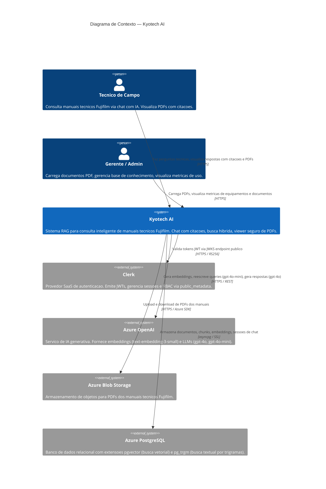

# C4 — Diagrama de Contexto: Kyotech AI

| Campo        | Valor                                       |
|--------------|---------------------------------------------|
| **Data**     | 2026-03-09                                  |
| **Autor**    | HaruCode (Equipe Kyotech AI)                |
| **Jira**     | IA-61                                       |

---

## Visão Geral

O diagrama de contexto mostra o sistema **Kyotech AI** e suas interações com atores humanos e sistemas externos. O Kyotech AI e um sistema RAG (Retrieval-Augmented Generation) projetado para consulta inteligente de manuais tecnicos Fujifilm por tecnicos de campo.

---

## Diagrama

---

## Descricao dos Elementos

### Atores

| Ator | Descricao | Papel (Role) |
|------|-----------|--------------|
| **Tecnico de Campo** | Profissional que realiza manutencao em equipamentos Fujifilm. Usa o chat para consultar procedimentos, codigos de pecas e boletins tecnicos. | `Technician` |
| **Gerente / Admin** | Responsavel pela gestao da base de conhecimento. Carrega novos manuais, acompanha metricas de uso e gerencia equipamentos. | `Admin` |

### Sistema Central

| Sistema | Descricao |
|---------|-----------|
| **Kyotech AI** | Aplicacao web RAG que permite consulta inteligente de manuais tecnicos Fujifilm. Combina busca hibrida (vetorial + textual), geracao de respostas com citacoes rastreavels e visualizacao segura de PDFs com watermark. |

### Sistemas Externos

| Sistema | Funcao no Kyotech AI |
|---------|---------------------|
| **Clerk** | Autenticacao e autorizacao. Emite JWTs validados no backend via JWKS. Roles (`Admin` / `Technician`) configurados via `public_metadata`. |
| **Azure OpenAI** | Modelo `text-embedding-3-small` para embeddings de chunks. Modelo `gpt-4o-mini` para reescrita de queries (PT→EN). Modelo `gpt-4o` para geracao de respostas com citacoes. |
| **Azure Blob Storage** | Armazenamento dos PDFs originais dos manuais. Organizado por `equipment_key/published_date/filename`. |
| **Azure PostgreSQL** | Banco de dados principal com `pgvector` para busca por similaridade coseno e `pg_trgm` para busca textual por trigramas. Armazena documentos, versoes, chunks com embeddings e sessoes de chat. |

---

## Fluxos Principais

1. **Consulta RAG:** Tecnico faz pergunta → Kyotech AI reescreve query → busca hibrida no PostgreSQL → gera resposta via Azure OpenAI → retorna com citacoes
2. **Upload de documento:** Admin carrega PDF → Kyotech AI extrai texto, gera embeddings via Azure OpenAI → armazena PDF no Blob Storage → insere chunks no PostgreSQL
3. **Visualizacao segura:** Tecnico clica em citacao → Kyotech AI baixa PDF do Blob Storage → renderiza pagina como PNG com watermark → retorna imagem (PDF nunca exposto)
4. **Autenticacao:** Usuario faz login via Clerk → recebe JWT → frontend envia Bearer token → backend valida via JWKS do Clerk
