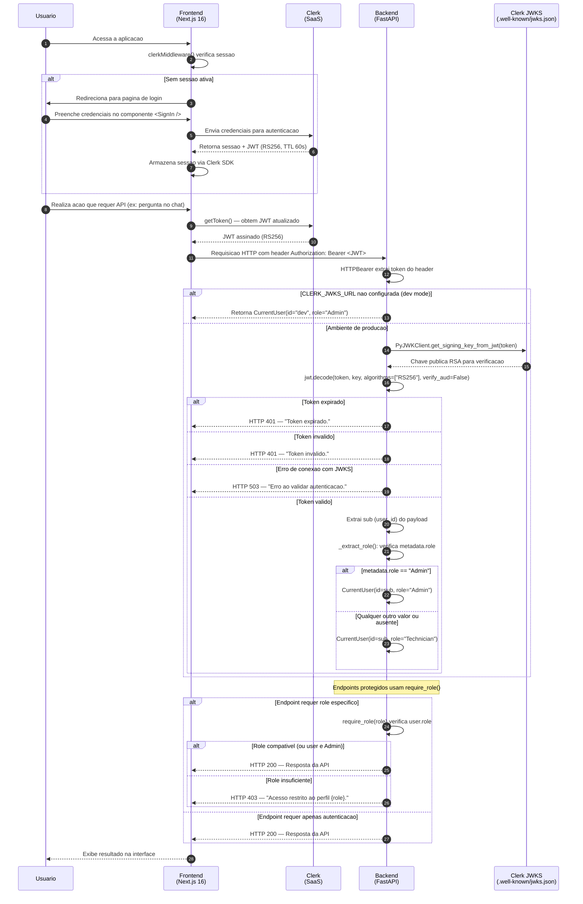

# Diagrama de Sequencia — Fluxo de Autenticacao

| Campo        | Valor                                       |
|--------------|---------------------------------------------|
| **Data**     | 2026-03-09                                  |
| **Autor**    | HaruCode (Equipe Kyotech AI)                |
| **Jira**     | IA-62                                       |
| **Fonte**    | `backend/app/core/auth.py`                  |

---

## Visao Geral

O fluxo de autenticacao utiliza **Clerk** como provedor de identidade. O frontend obtem um JWT via SDK do Clerk e o envia ao backend como Bearer token. O backend valida o JWT usando o endpoint JWKS publico do Clerk, extrai o role do usuario (`Admin` ou `Technician`) a partir do claim `metadata.role`, e autoriza o acesso.

---

## Diagrama



---

## Detalhes de Implementacao

### Validacao do JWT (`get_current_user`)

1. **`HTTPBearer`** extrai o token do header `Authorization: Bearer <token>`
2. Se `CLERK_JWKS_URL` nao esta configurada, retorna usuario de desenvolvimento (`id="dev"`, `role="Admin"`)
3. **`PyJWKClient`** busca a chave publica RSA no endpoint JWKS do Clerk (com cache interno)
4. **`jwt.decode`** valida o token com algoritmo RS256 (sem verificacao de audience)
5. O `sub` do payload e extraido como `user_id`
6. O role e extraido de `payload.metadata.role` — se for `"Admin"`, mantido; caso contrario, default `"Technician"`

### Autorizacao por Role (`require_role`)

- `require_role(role)` retorna uma dependency FastAPI que verifica se o `user.role` corresponde ao role exigido
- Usuarios com role `Admin` tem acesso a **todos** os endpoints (bypass implicito)
- Se o role nao corresponde, retorna HTTP 403

### Configuracao de Claims no Clerk

O JWT deve conter o claim `metadata` com o conteudo de `user.public_metadata`. Configuracao no Clerk Dashboard:

```
Sessions → Customize session token → Edit
{
  "metadata": "{{user.public_metadata}}"
}
```

Para atribuir role Admin a um usuario:

```
Users → Selecionar usuario → Public Metadata
{
  "role": "Admin"
}
```
