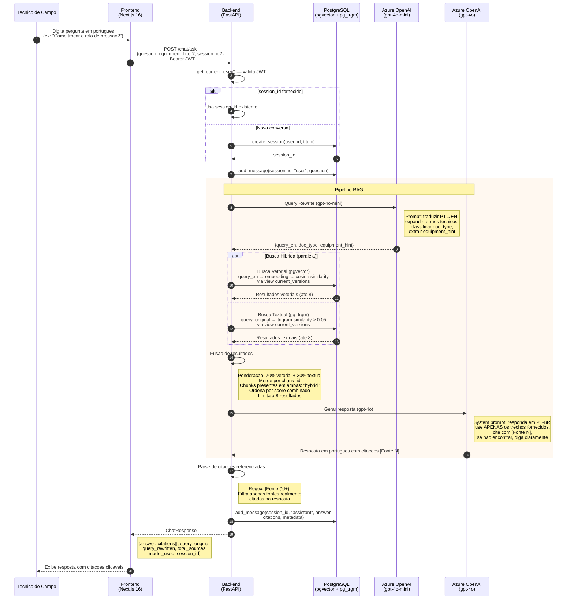

# Diagrama de Sequencia — Fluxo de Consulta RAG

| Campo        | Valor                                       |
|--------------|---------------------------------------------|
| **Data**     | 2026-03-09                                  |
| **Autor**    | HaruCode (Equipe Kyotech AI)                |
| **Jira**     | IA-62                                       |
| **Fonte**    | `backend/app/api/chat.py`, `backend/app/services/query_rewriter.py`, `backend/app/services/search.py`, `backend/app/services/generator.py` |

---

## Visao Geral

O fluxo de consulta RAG (Retrieval-Augmented Generation) permite que um tecnico faca perguntas em portugues sobre manuais tecnicos Fujifilm. O sistema reescreve a query para ingles tecnico, executa busca hibrida (vetorial + textual) no PostgreSQL, gera uma resposta em portugues com citacoes rastreavels via gpt-4o, e persiste toda a conversa para historico.

---

## Diagrama

---

## Detalhes do Pipeline

### 1. Query Rewrite (`query_rewriter.py`)

| Aspecto | Detalhe |
|---------|---------|
| **Modelo** | `gpt-4o-mini` (rapido e economico) |
| **Temperatura** | 0.1 (determinismo alto) |
| **Max tokens** | 200 |
| **Funcao** | Traduz portugues → ingles tecnico, expande termos, classifica `doc_type` (manual/informativo/both), extrai `equipment_hint` |
| **Fallback** | Se o parse JSON falhar, usa a query original sem modificacoes |

**Exemplo:**
- Input: `"Como trocar o rolo de pressao da Frontier 780?"`
- Output: `{query_en: "How to replace pressure roller Frontier 780", doc_type: "manual", equipment_hint: "frontier-780"}`

### 2. Busca Hibrida (`search.py`)

#### Busca Vetorial (pgvector)
- Gera embedding da `query_en` via Azure OpenAI (`text-embedding-3-small`)
- Calcula similaridade coseno: `1 - (embedding <=> query_embedding)`
- Filtra apenas versoes atuais via JOIN com view `current_versions`
- Filtros opcionais: `doc_type`, `equipment_key`

#### Busca Textual (pg_trgm)
- Usa a query original em portugues (para capturar codigos de pecas, numeros exatos)
- Calcula `similarity(content, query)` via extensao `pg_trgm`
- Threshold minimo: `similarity > 0.05`
- Filtros opcionais: `doc_type`, `equipment_key`

#### Fusao
- Merge por `chunk_id` para evitar duplicatas
- Score combinado: `score = (similarity_vetorial * 0.7) + (similarity_textual * 0.3)`
- Chunks encontrados em ambas as buscas sao marcados como `search_type: "hybrid"`
- Resultado final ordenado por score combinado, limitado a 8 chunks

### 3. Geracao de Resposta (`generator.py`)

| Aspecto | Detalhe |
|---------|---------|
| **Modelo** | `gpt-4o` (modelo mais capaz) |
| **Temperatura** | 0.2 (baixa criatividade, alta fidelidade) |
| **Max tokens** | 1500 |
| **Idioma de resposta** | Portugues brasileiro |
| **Citacoes** | Formato `[Fonte N]` inline, com lista de fontes ao final |
| **Sem resultados** | Retorna mensagem padrao sem chamar o LLM |

#### Regras do System Prompt
1. Responder **sempre** em portugues brasileiro
2. Usar **apenas** informacoes dos trechos fornecidos — nunca inventar
3. Citar a fonte `[Fonte N]` para cada afirmacao
4. Se nao encontrar a informacao, dizer claramente
5. Ser direto e tecnico
6. Se houver conflito entre fontes, mencionar ambas versoes

### 4. Parse de Citacoes

- Regex `\[Fonte (\d+)\]` extrai os indices citados na resposta
- Apenas as fontes efetivamente referenciadas sao incluidas no response
- Cada citacao inclui: `source_filename`, `page_number`, `equipment_key`, `doc_type`, `published_date`, `storage_path`, `document_version_id`

### 5. Persistencia

- Mensagem do usuario salva **antes** do pipeline RAG
- Resposta do assistente salva **apos** a geracao, incluindo `citations` e `metadata` (query reescrita, total de fontes, modelo usado)
- `session_id` retornado para continuidade da conversa
