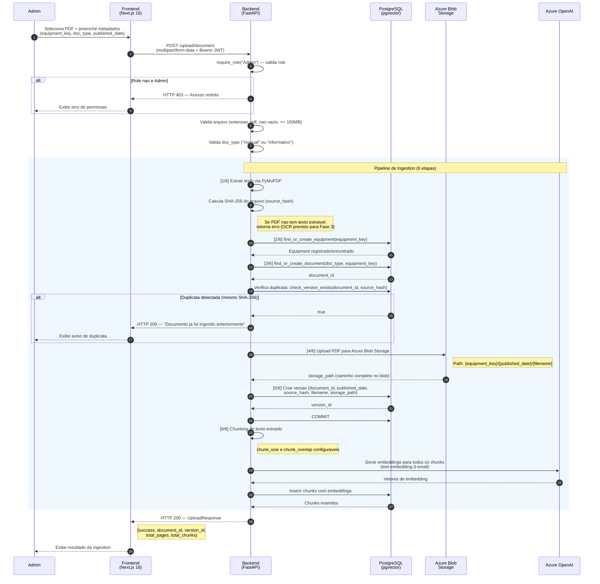

# Diagrama de Sequencia — Fluxo de Upload e Ingestion

| Campo        | Valor                                       |
|--------------|---------------------------------------------|
| **Data**     | 2026-03-09                                  |
| **Autor**    | HaruCode (Equipe Kyotech AI)                |
| **Jira**     | IA-62                                       |
| **Fonte**    | `backend/app/api/upload.py`, `backend/app/services/ingestion.py` |

---

## Visao Geral

O fluxo de upload e ingestion permite que um Admin carregue manuais PDF no sistema. O backend executa um pipeline de 6 etapas que extrai texto, registra o equipamento e documento, faz upload do PDF para o Azure Blob Storage, cria uma versao no banco de dados e, por fim, realiza chunking e geracao de embeddings para indexacao.

---

## Diagrama

---

## Detalhes das Etapas

### Validacoes Previas (API Layer)

| Validacao | Regra | Erro |
|-----------|-------|------|
| Autenticacao | Bearer JWT valido | HTTP 401 |
| Autorizacao | `require_role("Admin")` | HTTP 403 |
| Extensao | Arquivo deve ser `.pdf` | HTTP 400 |
| Tamanho minimo | Arquivo nao pode ser vazio | HTTP 400 |
| Tamanho maximo | Arquivo deve ter <= 100MB | HTTP 400 |
| Tipo de documento | `doc_type` deve ser `"manual"` ou `"informativo"` | HTTP 400 |

### Pipeline de Ingestion (6 Etapas)

| Etapa | Servico | Descricao |
|-------|---------|-----------|
| **[1/6]** | `pdf_extractor` | Extrai texto de cada pagina via PyMuPDF (`fitz`). Calcula hash SHA-256 do arquivo para deteccao de duplicatas. Falha se nenhuma pagina tem texto extraivel. |
| **[2/6]** | `repository` | `find_or_create_equipment()` — busca ou cria registro do equipamento pelo `equipment_key`. |
| **[3/6]** | `repository` | `find_or_create_document()` — busca ou cria registro do documento por `doc_type` + `equipment_key`. Retorna `document_id`. |
| **Duplicata** | `repository` | `check_version_exists()` — verifica se ja existe uma versao com o mesmo `source_hash`. Se sim, retorna sucesso com flag `was_duplicate=True`. |
| **[4/6]** | `storage` | `upload_pdf()` — envia os bytes do PDF para o Azure Blob Storage no path `{equipment_key}/{published_date}/{filename}`. |
| **[5/6]** | `repository` | `create_version()` — insere registro de versao no banco com `document_id`, `published_date`, `source_hash`, `source_filename` e `storage_path`. Commit apos esta etapa. |
| **[6/6]** | `chunker` + `embedder` + `repository` | Divide o texto em chunks (tamanho e overlap configuraveis), gera embeddings via Azure OpenAI (`text-embedding-3-small`), e insere todos os chunks com seus vetores no banco. |

### Tratamento de Erros

- **`ValueError`** (ex: PDF sem texto): retorna `IngestionResult(success=False, message=...)` → HTTP 422
- **Excecao generica**: executa `db.rollback()` e retorna mensagem amigavel → HTTP 422
