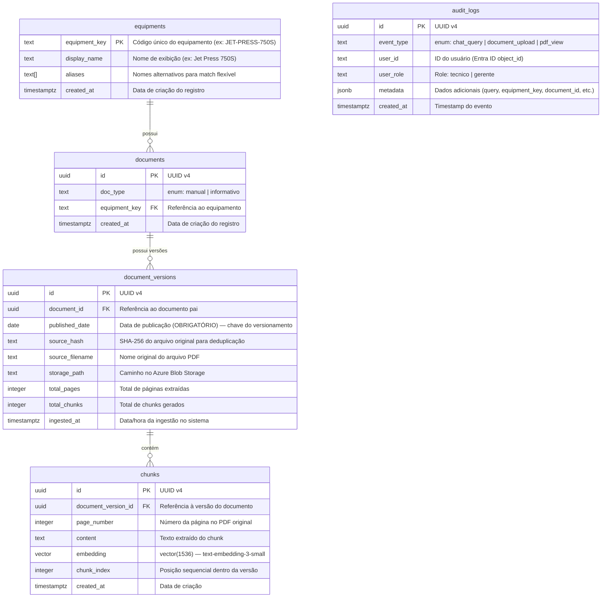

# Kyotech IA — Modelo de Dados (MVP)

**Ticket:** IA-63
**Autor:** Guilherme (HaruCode — Arquiteto/DevOps)
**Última atualização:** 2026-02-27
**Ref:** Seções 4 e 5 do Documento de Consolidação Técnica

---

## 1. Visão Geral

O modelo de dados do MVP suporta o ciclo completo do sistema RAG:

1. **Cadastro de equipamentos** — catálogo de equipamentos Fujifilm
2. **Ingestão de documentos** — upload de PDFs com metadados
3. **Versionamento** — controle de versões por data de publicação
4. **Indexação vetorial** — chunks com embeddings para busca semântica
5. **Auditoria** — logs de consultas e uploads

---

## 2. Diagrama Entidade-Relacionamento (ERD)



---

## 3. Regras de Negócio

### 3.1 Versionamento por `published_date` (Seção 5)

> **Decisão Arquitetural (ADR-001):** Os códigos da Fujifilm não seguem padrão. A única referência confiável é a data de publicação impressa no documento.

- `published_date` é **OBRIGATÓRIO** em toda `document_version`
- **Versão ativa** = registro com a **maior** `published_date` por `document_id`
- Versões antigas **NÃO são excluídas** — permanecem armazenadas para auditoria
- No pipeline RAG, apenas chunks da **versão ativa** são considerados na busca

**Query para versão ativa:**
```sql
-- Obtém apenas a versão mais recente de cada documento
SELECT DISTINCT ON (dv.document_id) dv.*
FROM document_versions dv
ORDER BY dv.document_id, dv.published_date DESC;
```

### 3.2 Deduplicação por `source_hash`

- Antes de processar um upload, o sistema calcula o SHA-256 do PDF
- Se o hash já existir em `document_versions` para o mesmo `document_id`, o upload é rejeitado (arquivo idêntico já foi ingerido)
- Hashes diferentes com mesmo `document_id` e `published_date` devem gerar um alerta (possível duplicata com conteúdo diferente)

### 3.3 Tipos de Documento (`doc_type`)

| Valor | Descrição | Comportamento no RAG |
|-------|-----------|---------------------|
| `manual` | Manual técnico completo do equipamento | Priorizado para perguntas sobre procedimentos e especificações |
| `informativo` | Boletim técnico, service bulletin, atualização | Priorizado para perguntas sobre correções, atualizações e alertas |

O **router RAG** classifica a pergunta do técnico e direciona a busca para o tipo adequado (ou ambos, se ambíguo).

### 3.4 Embeddings

- Modelo: `text-embedding-3-small` (Azure OpenAI)
- Dimensão: **1536**
- Métrica de similaridade: **cosine distance**
- Index: IVFFlat ou HNSW (ver DDL)

### 3.5 Auditoria (Seção 9)

Toda interação relevante é registrada em `audit_logs`:
- **chat_query**: pergunta do técnico + equipment_key filtrado
- **document_upload**: documento ingerido + user que fez upload
- **pdf_view**: visualização de PDF + página acessada

---

## 4. Índices e Performance

| Tabela | Índice | Tipo | Finalidade |
|--------|--------|------|-----------|
| `chunks` | `embedding` | HNSW (vector_cosine_ops) | Busca vetorial por similaridade |
| `chunks` | `content` | GIN (gin_trgm_ops) | Busca textual por trigramas |
| `document_versions` | `(document_id, published_date DESC)` | B-Tree | Lookup rápido da versão ativa |
| `document_versions` | `source_hash` | B-Tree | Deduplicação no upload |
| `documents` | `equipment_key` | B-Tree | Filtro por equipamento |
| `audit_logs` | `(event_type, created_at)` | B-Tree | Consultas de auditoria |

---

## 5. Considerações de Segurança

- **Nenhuma informação sensível nos embeddings** — os vetores são numéricos e não revertem para texto, mas o campo `content` contém texto original confidencial da Fujifilm
- **Acesso ao banco** exclusivamente via Private Endpoint (Seção 9)
- **SSL obrigatório** na connection string (`?sslmode=require`)
- **RBAC no app layer** — o banco não implementa row-level security no MVP; o controle de acesso é feito pelo middleware FastAPI

---