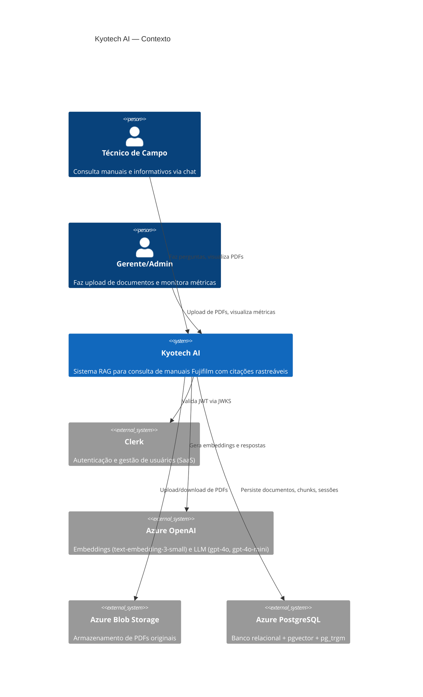
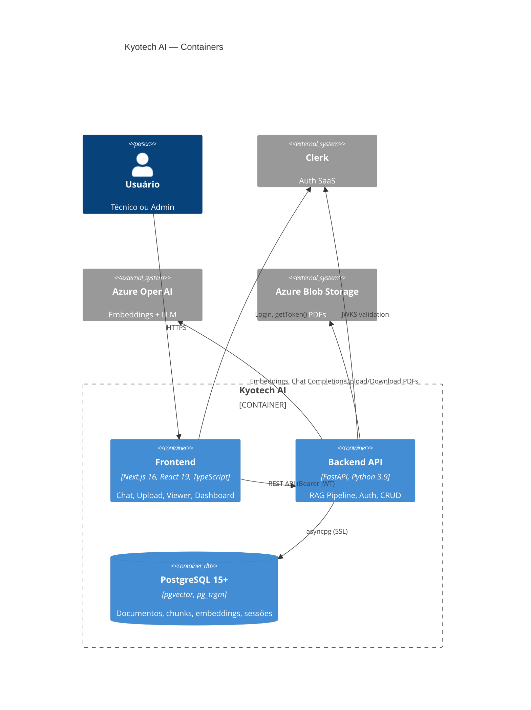
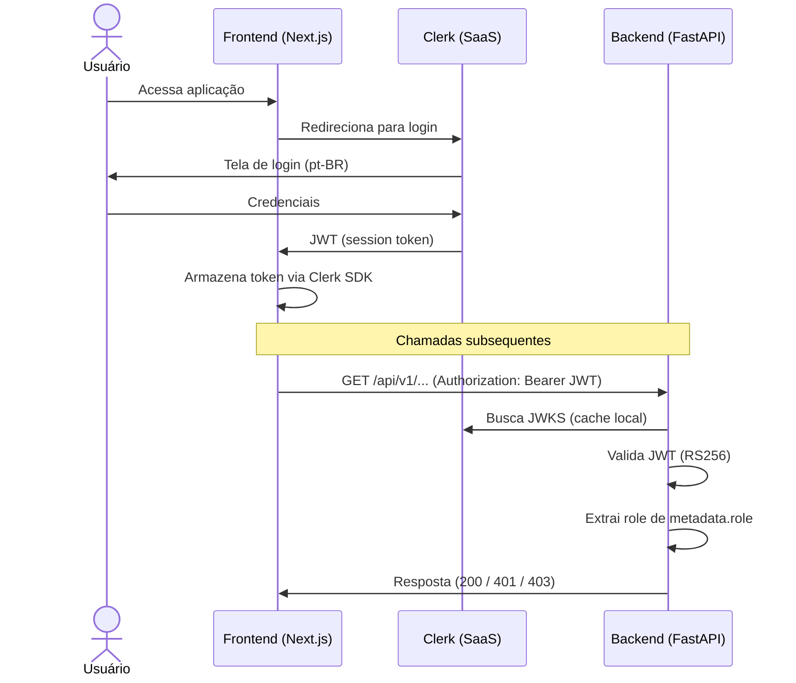
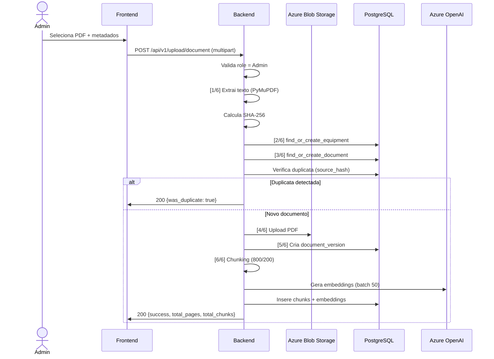
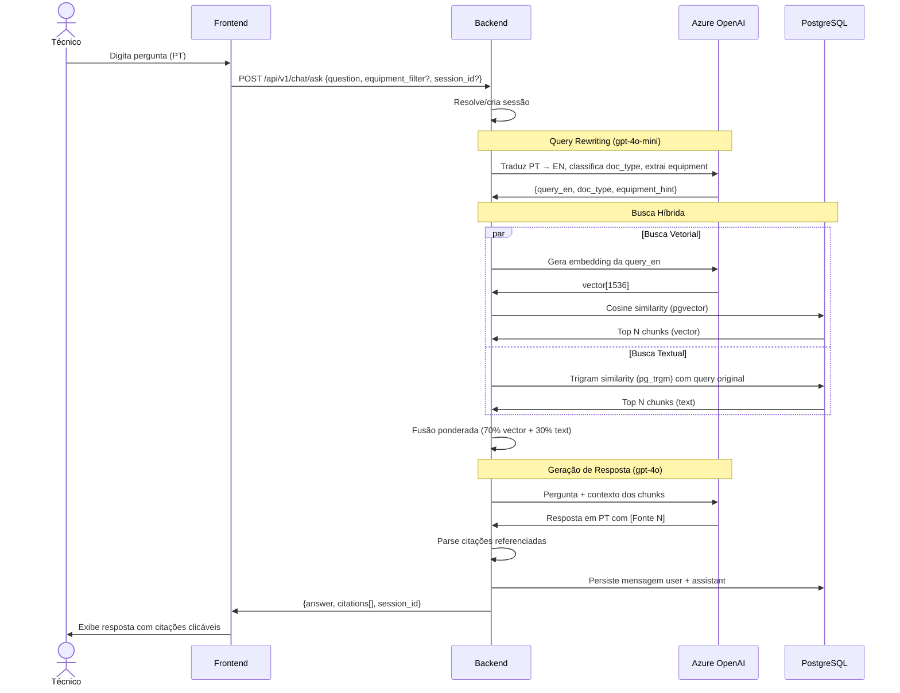

# Testes & Qualidade + Documentação — Implementation Plan

> **For Claude:** REQUIRED SUB-SKILL: Use superpowers:executing-plans to implement this plan task-by-task.

**Goal:** Estabelecer cobertura de testes robusta no backend e documentação técnica completa antes do hardening.

**Architecture:** Pytest com mocks robustos (AsyncMock, respx) para todos os serviços. Scalar para API docs. Markdown + Mermaid para documentação arquitetural. CI step no GitHub Actions.

**Tech Stack:** pytest, pytest-asyncio, pytest-cov, respx, scalar-fastapi, httpx, Mermaid

---

## Task 1: Setup — Dependencias e Configuracao de Teste

**Files:**
- Create: `backend/requirements-dev.txt`
- Create: `backend/pytest.ini`
- Modify: `backend/tests/__init__.py` (already exists, ensure empty)
- Create: `backend/tests/unit/__init__.py`
- Create: `backend/tests/integration/__init__.py`

**Step 1: Create requirements-dev.txt**

```
# backend/requirements-dev.txt
pytest>=8.0
pytest-asyncio>=0.24
pytest-cov>=6.0
respx>=0.22
```

**Step 2: Create pytest.ini**

```ini
# backend/pytest.ini
[pytest]
asyncio_mode = auto
testpaths = tests
python_files = test_*.py
python_classes = Test*
python_functions = test_*
addopts = -v --tb=short
```

**Step 3: Create __init__.py files for test directories**

```bash
mkdir -p backend/tests/unit backend/tests/integration
touch backend/tests/unit/__init__.py backend/tests/integration/__init__.py
```

**Step 4: Install dev dependencies and verify pytest runs**

Run: `cd backend && pip install -r requirements.txt -r requirements-dev.txt`
Then: `cd backend && python -m pytest --co -q`
Expected: "no tests ran" (collected 0 items)

**Step 5: Commit**

```bash
git add backend/requirements-dev.txt backend/pytest.ini backend/tests/
git commit -m "chore(IA-74): setup pytest infrastructure — deps, config, directories"
```

---

## Task 2: Fixtures Centrais — conftest.py

**Files:**
- Create: `backend/tests/conftest.py`

**Step 1: Write conftest.py with all shared fixtures**

```python
"""
Kyotech AI — Fixtures centrais de teste.
"""
from __future__ import annotations

import asyncio
from datetime import date
from unittest.mock import AsyncMock, MagicMock, patch
from uuid import UUID, uuid4

import fitz  # PyMuPDF
import httpx
import pytest
from fastapi import FastAPI

from app.core.auth import CurrentUser
from app.main import app as real_app


# ── Fake Users ──

@pytest.fixture
def fake_user_admin() -> CurrentUser:
    return CurrentUser(id="test-admin", role="Admin")


@pytest.fixture
def fake_user_tech() -> CurrentUser:
    return CurrentUser(id="test-tech", role="Technician")


# ── Mock Database Session ──

def _make_mock_result(rows: list | None = None, scalar: object = None):
    """Helper to build a mock SQLAlchemy result."""
    result = MagicMock()
    result.fetchone.return_value = rows[0] if rows else None
    result.fetchall.return_value = rows or []
    result.rowcount = len(rows) if rows else 0
    result.scalar.return_value = scalar
    return result


@pytest.fixture
def mock_db():
    session = AsyncMock()
    session.execute = AsyncMock(return_value=_make_mock_result())
    session.commit = AsyncMock()
    session.rollback = AsyncMock()
    return session


@pytest.fixture
def make_mock_result():
    """Factory fixture — call with rows to build a mock result."""
    return _make_mock_result


# ── Mock OpenAI Client ──

@pytest.fixture
def mock_openai_client():
    client = AsyncMock()

    # Default embedding response
    embedding_data = MagicMock()
    embedding_data.embedding = [0.1] * 1536
    embedding_response = MagicMock()
    embedding_response.data = [embedding_data]
    client.embeddings.create = AsyncMock(return_value=embedding_response)

    # Default chat response
    choice = MagicMock()
    choice.message.content = "Resposta de teste [Fonte 1]."
    chat_response = MagicMock()
    chat_response.choices = [choice]
    client.chat.completions.create = AsyncMock(return_value=chat_response)

    return client


# ── Mock Azure Blob Storage ──

@pytest.fixture
def mock_blob_client():
    client = MagicMock()
    blob = MagicMock()
    blob.upload_blob = MagicMock()
    downloader = MagicMock()
    downloader.readall.return_value = b"fake-pdf-bytes"
    blob.download_blob.return_value = downloader
    client.get_blob_client.return_value = blob
    client.account_name = "fakeaccount"
    return client


# ── Sample PDF Bytes ──

@pytest.fixture
def sample_pdf_bytes() -> bytes:
    """Generates a minimal valid PDF with 2 pages of text using PyMuPDF."""
    doc = fitz.open()
    for i in range(1, 3):
        page = doc.new_page(width=595, height=842)
        page.insert_text(
            fitz.Point(72, 72),
            f"Page {i} content: This is sample text for testing purposes.",
            fontsize=12,
        )
    pdf_bytes = doc.tobytes()
    doc.close()
    return pdf_bytes


# ── Test App with Dependency Overrides ──

@pytest.fixture
def test_app(fake_user_admin, mock_db):
    from app.core.auth import get_current_user
    from app.core.database import get_db

    real_app.dependency_overrides[get_current_user] = lambda: fake_user_admin
    real_app.dependency_overrides[get_db] = lambda: mock_db
    yield real_app
    real_app.dependency_overrides.clear()


@pytest.fixture
def test_app_tech(fake_user_tech, mock_db):
    """App with Technician user (non-admin)."""
    from app.core.auth import get_current_user
    from app.core.database import get_db

    real_app.dependency_overrides[get_current_user] = lambda: fake_user_tech
    real_app.dependency_overrides[get_db] = lambda: mock_db
    yield real_app
    real_app.dependency_overrides.clear()


@pytest.fixture
async def async_client(test_app):
    async with httpx.AsyncClient(
        transport=httpx.ASGITransport(app=test_app),
        base_url="http://test",
    ) as client:
        yield client


@pytest.fixture
async def async_client_tech(test_app_tech):
    async with httpx.AsyncClient(
        transport=httpx.ASGITransport(app=test_app_tech),
        base_url="http://test",
    ) as client:
        yield client
```

**Step 2: Verify conftest loads without errors**

Run: `cd backend && python -m pytest --co -q`
Expected: "no tests ran" (collected 0 items), no import errors

**Step 3: Commit**

```bash
git add backend/tests/conftest.py
git commit -m "chore(IA-74): add shared test fixtures — mock DB, OpenAI, Blob, auth, PDF"
```

---

## Task 3: Unit Tests — Chunker (logica pura)

**Files:**
- Create: `backend/tests/unit/test_chunker.py`

**Step 1: Write tests**

```python
"""Tests for the chunking service — pure logic, no mocks needed."""
from app.services.chunker import chunk_text, chunk_pages, TextChunk
from app.services.pdf_extractor import PageContent


class TestChunkText:
    def test_short_text_returns_single_chunk(self):
        text = "Short text."
        result = chunk_text(text, chunk_size=800, chunk_overlap=200)
        assert result == ["Short text."]

    def test_exact_chunk_size_returns_single_chunk(self):
        text = "a" * 800
        result = chunk_text(text, chunk_size=800, chunk_overlap=200)
        assert len(result) == 1

    def test_long_text_splits_into_multiple_chunks(self):
        text = "word " * 500  # 2500 chars
        result = chunk_text(text, chunk_size=800, chunk_overlap=200)
        assert len(result) > 1

    def test_overlap_creates_shared_content(self):
        text = "A " * 600  # 1200 chars
        result = chunk_text(text, chunk_size=800, chunk_overlap=200)
        assert len(result) >= 2
        # With overlap, second chunk should start before first chunk ends
        first_end = len(result[0])
        # The overlap means content is shared
        assert first_end > 200

    def test_empty_text_returns_empty_list(self):
        result = chunk_text("   ", chunk_size=800, chunk_overlap=200)
        assert result == []

    def test_prefers_newline_break(self):
        text = "a" * 300 + "\n" + "b" * 300 + "\n" + "c" * 300
        result = chunk_text(text, chunk_size=800, chunk_overlap=200)
        # Should break at newline rather than mid-word
        assert result[0].endswith("\n") or len(result[0]) <= 800

    def test_prefers_space_break_over_mid_word(self):
        text = "word " * 200  # 1000 chars, spaces available
        result = chunk_text(text, chunk_size=100, chunk_overlap=20)
        for chunk in result:
            # Chunks should not end mid-word (should end at space)
            assert chunk == chunk.strip()


class TestChunkPages:
    def test_single_page_with_text(self):
        pages = [PageContent(page_number=1, text="Some content here.")]
        result = chunk_pages(pages, chunk_size=800, chunk_overlap=200)
        assert len(result) == 1
        assert result[0].page_number == 1
        assert result[0].chunk_index == 0
        assert result[0].content == "Some content here."

    def test_empty_page_is_skipped(self):
        pages = [
            PageContent(page_number=1, text="Content"),
            PageContent(page_number=2, text="   "),
            PageContent(page_number=3, text="More content"),
        ]
        result = chunk_pages(pages, chunk_size=800, chunk_overlap=200)
        assert len(result) == 2
        assert result[0].page_number == 1
        assert result[1].page_number == 3

    def test_multiple_chunks_per_page(self):
        pages = [PageContent(page_number=1, text="word " * 500)]
        result = chunk_pages(pages, chunk_size=100, chunk_overlap=20)
        assert len(result) > 1
        assert all(c.page_number == 1 for c in result)
        # chunk_index should be sequential
        indices = [c.chunk_index for c in result]
        assert indices == list(range(len(result)))

    def test_empty_pages_list(self):
        result = chunk_pages([], chunk_size=800, chunk_overlap=200)
        assert result == []

    def test_returns_text_chunk_dataclass(self):
        pages = [PageContent(page_number=5, text="Test")]
        result = chunk_pages(pages)
        assert isinstance(result[0], TextChunk)
        assert result[0].page_number == 5
```

**Step 2: Run tests to verify they pass**

Run: `cd backend && python -m pytest tests/unit/test_chunker.py -v`
Expected: All PASS (chunker is pure logic, already implemented)

**Step 3: Commit**

```bash
git add backend/tests/unit/test_chunker.py
git commit -m "test(IA-74): add unit tests for chunker service"
```

---

## Task 4: Unit Tests — PDF Extractor

**Files:**
- Create: `backend/tests/unit/test_pdf_extractor.py`

**Step 1: Write tests**

```python
"""Tests for PDF text extraction and hashing."""
import hashlib

import pytest

from app.services.pdf_extractor import (
    compute_file_hash,
    extract_text_from_pdf,
    PageContent,
    PDFExtraction,
)


class TestComputeFileHash:
    def test_returns_sha256_hex(self):
        data = b"test content"
        expected = hashlib.sha256(data).hexdigest()
        assert compute_file_hash(data) == expected

    def test_different_content_different_hash(self):
        assert compute_file_hash(b"a") != compute_file_hash(b"b")

    def test_same_content_same_hash(self):
        assert compute_file_hash(b"same") == compute_file_hash(b"same")


class TestExtractTextFromPdf:
    def test_extracts_text_from_valid_pdf(self, sample_pdf_bytes):
        result = extract_text_from_pdf(sample_pdf_bytes, "test.pdf")
        assert isinstance(result, PDFExtraction)
        assert result.filename == "test.pdf"
        assert result.total_pages == 2
        assert len(result.pages) == 2
        assert result.source_hash == hashlib.sha256(sample_pdf_bytes).hexdigest()

    def test_pages_have_correct_numbers(self, sample_pdf_bytes):
        result = extract_text_from_pdf(sample_pdf_bytes, "test.pdf")
        assert result.pages[0].page_number == 1
        assert result.pages[1].page_number == 2

    def test_pages_contain_text(self, sample_pdf_bytes):
        result = extract_text_from_pdf(sample_pdf_bytes, "test.pdf")
        assert "sample text" in result.pages[0].text.lower()

    def test_raises_on_empty_pdf(self):
        """A PDF with no extractable text should raise ValueError."""
        import fitz
        doc = fitz.open()
        doc.new_page()  # blank page, no text
        pdf_bytes = doc.tobytes()
        doc.close()

        with pytest.raises(ValueError, match="não contém texto"):
            extract_text_from_pdf(pdf_bytes, "empty.pdf")

    def test_raises_on_invalid_bytes(self):
        with pytest.raises(Exception):
            extract_text_from_pdf(b"not a pdf", "bad.pdf")
```

**Step 2: Run tests**

Run: `cd backend && python -m pytest tests/unit/test_pdf_extractor.py -v`
Expected: All PASS

**Step 3: Commit**

```bash
git add backend/tests/unit/test_pdf_extractor.py
git commit -m "test(IA-74): add unit tests for PDF extractor"
```

---

## Task 5: Unit Tests — Auth

**Files:**
- Create: `backend/tests/unit/test_auth.py`

**Step 1: Write tests**

```python
"""Tests for authentication and authorization."""
from unittest.mock import AsyncMock, MagicMock, patch

import jwt
import pytest
from fastapi import HTTPException

from app.core.auth import (
    CurrentUser,
    _extract_role,
    get_current_user,
    require_role,
)


class TestExtractRole:
    def test_admin_role(self):
        claims = {"metadata": {"role": "Admin"}}
        assert _extract_role(claims) == "Admin"

    def test_technician_by_default(self):
        claims = {"metadata": {"role": "Technician"}}
        assert _extract_role(claims) == "Technician"

    def test_no_metadata_defaults_to_technician(self):
        assert _extract_role({}) == "Technician"

    def test_metadata_not_dict_defaults_to_technician(self):
        assert _extract_role({"metadata": "string"}) == "Technician"

    def test_no_role_key_defaults_to_technician(self):
        assert _extract_role({"metadata": {}}) == "Technician"


class TestGetCurrentUser:
    @pytest.mark.asyncio
    async def test_dev_mode_returns_admin(self):
        """When clerk_jwks_url is empty, returns dev admin user."""
        with patch("app.core.auth.settings") as mock_settings:
            mock_settings.clerk_jwks_url = ""
            user = await get_current_user(credentials=None)
            assert user.id == "dev"
            assert user.role == "Admin"

    @pytest.mark.asyncio
    async def test_missing_token_raises_401(self):
        with patch("app.core.auth.settings") as mock_settings:
            mock_settings.clerk_jwks_url = "https://fake.clerk.dev/.well-known/jwks.json"
            with pytest.raises(HTTPException) as exc_info:
                await get_current_user(credentials=None)
            assert exc_info.value.status_code == 401

    @pytest.mark.asyncio
    async def test_expired_token_raises_401(self):
        with patch("app.core.auth.settings") as mock_settings:
            mock_settings.clerk_jwks_url = "https://fake.clerk.dev/.well-known/jwks.json"
            with patch("app.core.auth._get_jwk_client") as mock_jwk:
                mock_jwk.return_value.get_signing_key_from_jwt.side_effect = (
                    jwt.ExpiredSignatureError("Token expired")
                )
                creds = MagicMock()
                creds.credentials = "expired-token"
                with pytest.raises(HTTPException) as exc_info:
                    await get_current_user(credentials=creds)
                assert exc_info.value.status_code == 401
                assert "expirado" in exc_info.value.detail

    @pytest.mark.asyncio
    async def test_invalid_token_raises_401(self):
        with patch("app.core.auth.settings") as mock_settings:
            mock_settings.clerk_jwks_url = "https://fake.clerk.dev/.well-known/jwks.json"
            with patch("app.core.auth._get_jwk_client") as mock_jwk:
                mock_jwk.return_value.get_signing_key_from_jwt.side_effect = (
                    jwt.InvalidTokenError("bad token")
                )
                creds = MagicMock()
                creds.credentials = "bad-token"
                with pytest.raises(HTTPException) as exc_info:
                    await get_current_user(credentials=creds)
                assert exc_info.value.status_code == 401

    @pytest.mark.asyncio
    async def test_jwks_failure_raises_503(self):
        with patch("app.core.auth.settings") as mock_settings:
            mock_settings.clerk_jwks_url = "https://fake.clerk.dev/.well-known/jwks.json"
            with patch("app.core.auth._get_jwk_client") as mock_jwk:
                mock_jwk.return_value.get_signing_key_from_jwt.side_effect = (
                    ConnectionError("network error")
                )
                creds = MagicMock()
                creds.credentials = "some-token"
                with pytest.raises(HTTPException) as exc_info:
                    await get_current_user(credentials=creds)
                assert exc_info.value.status_code == 503


class TestRequireRole:
    @pytest.mark.asyncio
    async def test_admin_can_access_admin_route(self):
        checker = require_role("Admin")
        user = CurrentUser(id="u1", role="Admin")
        result = await checker(user=user)
        assert result.role == "Admin"

    @pytest.mark.asyncio
    async def test_technician_cannot_access_admin_route(self):
        checker = require_role("Admin")
        user = CurrentUser(id="u1", role="Technician")
        with pytest.raises(HTTPException) as exc_info:
            await checker(user=user)
        assert exc_info.value.status_code == 403

    @pytest.mark.asyncio
    async def test_admin_can_access_technician_route(self):
        """Admin has access to everything."""
        checker = require_role("Technician")
        user = CurrentUser(id="u1", role="Admin")
        result = await checker(user=user)
        assert result.role == "Admin"
```

**Step 2: Run tests**

Run: `cd backend && python -m pytest tests/unit/test_auth.py -v`
Expected: All PASS

**Step 3: Commit**

```bash
git add backend/tests/unit/test_auth.py
git commit -m "test(IA-74): add unit tests for auth — JWT validation, roles, dev mode"
```

---

## Task 6: Unit Tests — Embedder

**Files:**
- Create: `backend/tests/unit/test_embedder.py`

**Step 1: Write tests**

```python
"""Tests for the embeddings service."""
from unittest.mock import AsyncMock, MagicMock, patch

import pytest

from app.services.embedder import generate_embeddings, generate_single_embedding


@pytest.fixture
def _patch_openai(mock_openai_client):
    with patch("app.services.embedder._client", mock_openai_client):
        with patch("app.services.embedder.get_openai_client", return_value=mock_openai_client):
            yield mock_openai_client


class TestGenerateEmbeddings:
    @pytest.mark.asyncio
    async def test_single_text(self, _patch_openai):
        result = await generate_embeddings(["hello"])
        assert len(result) == 1
        assert len(result[0]) == 1536

    @pytest.mark.asyncio
    async def test_batching(self, _patch_openai):
        """Texts exceeding batch_size should be split into batches."""
        texts = [f"text {i}" for i in range(120)]

        # Each call returns batch_size embeddings
        def make_response(batch):
            items = []
            for _ in batch:
                item = MagicMock()
                item.embedding = [0.1] * 1536
                items.append(item)
            resp = MagicMock()
            resp.data = items
            return resp

        _patch_openai.embeddings.create = AsyncMock(
            side_effect=lambda input, model: make_response(input)
        )

        result = await generate_embeddings(texts, batch_size=50)
        assert len(result) == 120
        # Should have been called 3 times (50 + 50 + 20)
        assert _patch_openai.embeddings.create.call_count == 3

    @pytest.mark.asyncio
    async def test_empty_list(self, _patch_openai):
        result = await generate_embeddings([])
        assert result == []


class TestGenerateSingleEmbedding:
    @pytest.mark.asyncio
    async def test_returns_single_vector(self, _patch_openai):
        result = await generate_single_embedding("test query")
        assert len(result) == 1536
        _patch_openai.embeddings.create.assert_called_once()
```

**Step 2: Run tests**

Run: `cd backend && python -m pytest tests/unit/test_embedder.py -v`
Expected: All PASS

**Step 3: Commit**

```bash
git add backend/tests/unit/test_embedder.py
git commit -m "test(IA-74): add unit tests for embedder service"
```

---

## Task 7: Unit Tests — Query Rewriter

**Files:**
- Create: `backend/tests/unit/test_query_rewriter.py`

**Step 1: Write tests**

```python
"""Tests for the query rewriting service."""
import json
from unittest.mock import AsyncMock, MagicMock, patch

import pytest

from app.services.query_rewriter import rewrite_query, RewrittenQuery


def _make_chat_response(content: str):
    choice = MagicMock()
    choice.message.content = content
    resp = MagicMock()
    resp.choices = [choice]
    return resp


@pytest.fixture
def _patch_openai(mock_openai_client):
    with patch("app.services.embedder._client", mock_openai_client):
        with patch("app.services.embedder.get_openai_client", return_value=mock_openai_client):
            yield mock_openai_client


class TestRewriteQuery:
    @pytest.mark.asyncio
    async def test_valid_json_response(self, _patch_openai):
        response_json = json.dumps({
            "query_en": "How to replace pressure roller",
            "doc_type": "manual",
            "equipment_hint": "frontier-780",
        })
        _patch_openai.chat.completions.create = AsyncMock(
            return_value=_make_chat_response(response_json)
        )

        result = await rewrite_query("Como trocar o rolo de pressao?")
        assert isinstance(result, RewrittenQuery)
        assert result.query_en == "How to replace pressure roller"
        assert result.doc_type == "manual"
        assert result.equipment_hint == "frontier-780"
        assert result.original == "Como trocar o rolo de pressao?"

    @pytest.mark.asyncio
    async def test_doc_type_both_becomes_none(self, _patch_openai):
        response_json = json.dumps({
            "query_en": "Query",
            "doc_type": "both",
            "equipment_hint": None,
        })
        _patch_openai.chat.completions.create = AsyncMock(
            return_value=_make_chat_response(response_json)
        )

        result = await rewrite_query("Pergunta geral")
        assert result.doc_type is None

    @pytest.mark.asyncio
    async def test_equipment_hint_null_string_becomes_none(self, _patch_openai):
        response_json = json.dumps({
            "query_en": "Query",
            "doc_type": "manual",
            "equipment_hint": "null",
        })
        _patch_openai.chat.completions.create = AsyncMock(
            return_value=_make_chat_response(response_json)
        )

        result = await rewrite_query("Pergunta")
        assert result.equipment_hint is None

    @pytest.mark.asyncio
    async def test_equipment_hint_normalized(self, _patch_openai):
        response_json = json.dumps({
            "query_en": "Query",
            "doc_type": "manual",
            "equipment_hint": "Frontier 780",
        })
        _patch_openai.chat.completions.create = AsyncMock(
            return_value=_make_chat_response(response_json)
        )

        result = await rewrite_query("Pergunta")
        assert result.equipment_hint == "frontier-780"

    @pytest.mark.asyncio
    async def test_invalid_json_falls_back(self, _patch_openai):
        _patch_openai.chat.completions.create = AsyncMock(
            return_value=_make_chat_response("not valid json {{{")
        )

        result = await rewrite_query("Pergunta original")
        assert result.query_en == "Pergunta original"
        assert result.doc_type is None
        assert result.equipment_hint is None
```

**Step 2: Run tests**

Run: `cd backend && python -m pytest tests/unit/test_query_rewriter.py -v`
Expected: All PASS

**Step 3: Commit**

```bash
git add backend/tests/unit/test_query_rewriter.py
git commit -m "test(IA-74): add unit tests for query rewriter"
```

---

## Task 8: Unit Tests — Generator

**Files:**
- Create: `backend/tests/unit/test_generator.py`

**Step 1: Write tests**

```python
"""Tests for the response generator service."""
from datetime import date
from unittest.mock import AsyncMock, MagicMock, patch

import pytest

from app.services.generator import build_context, generate_response, RAGResponse, Citation
from app.services.search import SearchResult


def _make_search_result(**overrides) -> SearchResult:
    defaults = dict(
        chunk_id="chunk-1",
        content="Sample content about pressure roller.",
        page_number=5,
        similarity=0.85,
        document_id="doc-1",
        doc_type="manual",
        equipment_key="frontier-780",
        published_date=date(2025, 1, 15),
        source_filename="frontier_780_manual.pdf",
        storage_path="pdfs-originais/frontier-780/2025-01-15/manual.pdf",
        search_type="vector",
        document_version_id="ver-1",
    )
    defaults.update(overrides)
    return SearchResult(**defaults)


class TestBuildContext:
    def test_formats_single_result(self):
        results = [_make_search_result()]
        context = build_context(results)
        assert "[Fonte 1]" in context
        assert "frontier_780_manual.pdf" in context
        assert "Página: 5" in context
        assert "Sample content about pressure roller." in context

    def test_formats_multiple_results(self):
        results = [
            _make_search_result(chunk_id="c1"),
            _make_search_result(chunk_id="c2", page_number=10),
        ]
        context = build_context(results)
        assert "[Fonte 1]" in context
        assert "[Fonte 2]" in context
        assert "---" in context


class TestGenerateResponse:
    @pytest.mark.asyncio
    async def test_empty_results_returns_fallback(self):
        result = await generate_response("Pergunta?", "Question?", [])
        assert isinstance(result, RAGResponse)
        assert "Não encontrei" in result.answer
        assert result.citations == []
        assert result.total_sources == 0

    @pytest.mark.asyncio
    async def test_generates_with_citations(self, mock_openai_client):
        with patch("app.services.embedder._client", mock_openai_client):
            with patch("app.services.embedder.get_openai_client", return_value=mock_openai_client):
                # Mock response references [Fonte 1]
                choice = MagicMock()
                choice.message.content = "O rolo de pressao fica na area X [Fonte 1]."
                chat_resp = MagicMock()
                chat_resp.choices = [choice]
                mock_openai_client.chat.completions.create = AsyncMock(return_value=chat_resp)

                results = [_make_search_result()]
                response = await generate_response("Como trocar?", "How to replace?", results)

                assert "rolo de pressao" in response.answer
                assert len(response.citations) == 1
                assert response.citations[0].source_index == 1
                assert response.citations[0].page_number == 5
                assert response.total_sources == 1

    @pytest.mark.asyncio
    async def test_unreferenced_sources_excluded_from_citations(self, mock_openai_client):
        with patch("app.services.embedder._client", mock_openai_client):
            with patch("app.services.embedder.get_openai_client", return_value=mock_openai_client):
                choice = MagicMock()
                choice.message.content = "Resposta sem citacoes."
                chat_resp = MagicMock()
                chat_resp.choices = [choice]
                mock_openai_client.chat.completions.create = AsyncMock(return_value=chat_resp)

                results = [_make_search_result()]
                response = await generate_response("Pergunta", "Question", results)

                # No [Fonte N] in answer → no citations
                assert response.citations == []
                assert response.total_sources == 1
```

**Step 2: Run tests**

Run: `cd backend && python -m pytest tests/unit/test_generator.py -v`
Expected: All PASS

**Step 3: Commit**

```bash
git add backend/tests/unit/test_generator.py
git commit -m "test(IA-74): add unit tests for response generator"
```

---

## Task 9: Unit Tests — Search

**Files:**
- Create: `backend/tests/unit/test_search.py`

**Step 1: Write tests**

```python
"""Tests for the hybrid search service."""
from datetime import date
from unittest.mock import AsyncMock, MagicMock, patch

import pytest

from app.services.search import (
    hybrid_search,
    text_search,
    vector_search,
    SearchResult,
)


def _make_db_row(
    chunk_id="chunk-1",
    content="Test content",
    page_number=1,
    similarity=0.85,
    document_id="doc-1",
    doc_type="manual",
    equipment_key="frontier-780",
    published_date=date(2025, 1, 15),
    source_filename="manual.pdf",
    storage_path="container/path",
    version_id="ver-1",
):
    return (
        chunk_id, content, page_number, similarity,
        document_id, doc_type, equipment_key,
        published_date, source_filename, storage_path, version_id,
    )


@pytest.fixture
def _patch_embedder():
    with patch(
        "app.services.search.generate_single_embedding",
        new_callable=AsyncMock,
        return_value=[0.1] * 1536,
    ):
        yield


class TestVectorSearch:
    @pytest.mark.asyncio
    async def test_returns_search_results(self, mock_db, make_mock_result, _patch_embedder):
        rows = [_make_db_row()]
        mock_db.execute = AsyncMock(return_value=make_mock_result(rows=rows))

        results = await vector_search(mock_db, "test query")
        assert len(results) == 1
        assert isinstance(results[0], SearchResult)
        assert results[0].search_type == "vector"
        assert results[0].chunk_id == "chunk-1"

    @pytest.mark.asyncio
    async def test_empty_results(self, mock_db, make_mock_result, _patch_embedder):
        mock_db.execute = AsyncMock(return_value=make_mock_result(rows=[]))
        results = await vector_search(mock_db, "nothing")
        assert results == []

    @pytest.mark.asyncio
    async def test_passes_filters(self, mock_db, make_mock_result, _patch_embedder):
        mock_db.execute = AsyncMock(return_value=make_mock_result(rows=[]))
        await vector_search(
            mock_db, "query", doc_type="manual", equipment_key="frontier-780"
        )
        call_args = mock_db.execute.call_args
        query_str = str(call_args[0][0].text)
        assert "doc_type" in query_str
        assert "equipment" in query_str


class TestTextSearch:
    @pytest.mark.asyncio
    async def test_returns_search_results(self, mock_db, make_mock_result):
        rows = [_make_db_row(similarity=0.3)]
        mock_db.execute = AsyncMock(return_value=make_mock_result(rows=rows))

        results = await text_search(mock_db, "error code 123")
        assert len(results) == 1
        assert results[0].search_type == "text"


class TestHybridSearch:
    @pytest.mark.asyncio
    async def test_merges_vector_and_text(self, mock_db, make_mock_result, _patch_embedder):
        vector_row = _make_db_row(chunk_id="c1", similarity=0.9)
        text_row = _make_db_row(chunk_id="c2", similarity=0.4)

        call_count = 0

        async def side_effect(*args, **kwargs):
            nonlocal call_count
            call_count += 1
            if call_count == 1:  # vector search
                return make_mock_result(rows=[vector_row])
            else:  # text search
                return make_mock_result(rows=[text_row])

        mock_db.execute = AsyncMock(side_effect=side_effect)

        results = await hybrid_search(
            mock_db, query_en="english query", query_original="pergunta original"
        )
        assert len(results) == 2
        # First result should be the vector one (higher weighted score)
        assert results[0].chunk_id == "c1"

    @pytest.mark.asyncio
    async def test_deduplicates_by_chunk_id(self, mock_db, make_mock_result, _patch_embedder):
        same_row = _make_db_row(chunk_id="c1", similarity=0.8)

        mock_db.execute = AsyncMock(return_value=make_mock_result(rows=[same_row]))

        results = await hybrid_search(
            mock_db, query_en="query", query_original="pergunta"
        )
        # Same chunk_id in both searches → merged into one
        assert len(results) == 1
        assert results[0].search_type == "hybrid"
```

**Step 2: Run tests**

Run: `cd backend && python -m pytest tests/unit/test_search.py -v`
Expected: All PASS

**Step 3: Commit**

```bash
git add backend/tests/unit/test_search.py
git commit -m "test(IA-74): add unit tests for hybrid search"
```

---

## Task 10: Unit Tests — Storage

**Files:**
- Create: `backend/tests/unit/test_storage.py`

**Step 1: Write tests**

```python
"""Tests for Azure Blob Storage service."""
from unittest.mock import MagicMock, patch

import pytest

from app.services.storage import download_blob, generate_signed_url, upload_pdf


class TestUploadPdf:
    @pytest.mark.asyncio
    async def test_uploads_to_correct_container(self, mock_blob_client):
        with patch("app.services.storage._blob_client", mock_blob_client):
            with patch("app.services.storage.get_blob_client", return_value=mock_blob_client):
                result = await upload_pdf(b"pdf-bytes", "frontier-780/2025-01-15/manual.pdf")

                assert "pdfs-originais" in result
                assert "frontier-780" in result
                mock_blob_client.get_blob_client.assert_called_once()

    @pytest.mark.asyncio
    async def test_custom_container(self, mock_blob_client):
        with patch("app.services.storage._blob_client", mock_blob_client):
            with patch("app.services.storage.get_blob_client", return_value=mock_blob_client):
                result = await upload_pdf(
                    b"pdf-bytes", "path.pdf", container="custom-container"
                )
                assert "custom-container" in result


class TestDownloadBlob:
    @pytest.mark.asyncio
    async def test_downloads_and_splits_path(self, mock_blob_client):
        with patch("app.services.storage._blob_client", mock_blob_client):
            with patch("app.services.storage.get_blob_client", return_value=mock_blob_client):
                result = await download_blob("container-name/blob/path.pdf")

                assert result == b"fake-pdf-bytes"
                mock_blob_client.get_blob_client.assert_called_with(
                    container="container-name", blob="blob/path.pdf"
                )


class TestGenerateSignedUrl:
    def test_generates_sas_url(self, mock_blob_client):
        with patch("app.services.storage._blob_client", mock_blob_client):
            with patch("app.services.storage.get_blob_client", return_value=mock_blob_client):
                with patch("app.services.storage.settings") as mock_settings:
                    mock_settings.azure_storage_connection_string = (
                        "DefaultEndpointsProtocol=https;"
                        "AccountName=fakeaccount;"
                        "AccountKey=ZmFrZWtleQ==;"
                        "EndpointSuffix=core.windows.net"
                    )
                    with patch("app.services.storage.generate_blob_sas", return_value="sas-token"):
                        url = generate_signed_url("container/blob/path.pdf")
                        assert "fakeaccount.blob.core.windows.net" in url
                        assert "sas-token" in url
```

**Step 2: Run tests**

Run: `cd backend && python -m pytest tests/unit/test_storage.py -v`
Expected: All PASS

**Step 3: Commit**

```bash
git add backend/tests/unit/test_storage.py
git commit -m "test(IA-74): add unit tests for storage service"
```

---

## Task 11: Unit Tests — Viewer Service

**Files:**
- Create: `backend/tests/unit/test_viewer_service.py`

**Step 1: Write tests**

```python
"""Tests for the PDF viewer rendering service."""
import pytest

from app.services.viewer import render_page_as_image


class TestRenderPageAsImage:
    def test_renders_valid_page(self, sample_pdf_bytes):
        png_bytes, total_pages = render_page_as_image(
            sample_pdf_bytes, page_number=1, user_id="test-user"
        )
        assert isinstance(png_bytes, bytes)
        assert len(png_bytes) > 0
        # PNG magic bytes
        assert png_bytes[:4] == b"\x89PNG"
        assert total_pages == 2

    def test_renders_second_page(self, sample_pdf_bytes):
        png_bytes, total_pages = render_page_as_image(
            sample_pdf_bytes, page_number=2, user_id="test-user"
        )
        assert png_bytes[:4] == b"\x89PNG"
        assert total_pages == 2

    def test_invalid_page_zero_raises(self, sample_pdf_bytes):
        with pytest.raises(ValueError, match="inválida"):
            render_page_as_image(sample_pdf_bytes, page_number=0, user_id="u1")

    def test_invalid_page_too_high_raises(self, sample_pdf_bytes):
        with pytest.raises(ValueError, match="inválida"):
            render_page_as_image(sample_pdf_bytes, page_number=99, user_id="u1")

    def test_custom_watermark_text(self, sample_pdf_bytes):
        # Should not raise — watermark is visual only
        png_bytes, _ = render_page_as_image(
            sample_pdf_bytes, page_number=1, user_id="u1",
            watermark_text="CONFIDENTIAL",
        )
        assert len(png_bytes) > 0
```

**Step 2: Run tests**

Run: `cd backend && python -m pytest tests/unit/test_viewer_service.py -v`
Expected: All PASS

**Step 3: Commit**

```bash
git add backend/tests/unit/test_viewer_service.py
git commit -m "test(IA-74): add unit tests for viewer rendering service"
```

---

## Task 12: Unit Tests — Repository

**Files:**
- Create: `backend/tests/unit/test_repository.py`

**Step 1: Write tests**

```python
"""Tests for the data repository."""
from datetime import date
from unittest.mock import AsyncMock
from uuid import uuid4

import pytest

from app.services import repository
from app.services.chunker import TextChunk


class TestFindOrCreateEquipment:
    @pytest.mark.asyncio
    async def test_existing_equipment_returns_key(self, mock_db, make_mock_result):
        mock_db.execute = AsyncMock(
            return_value=make_mock_result(rows=[("frontier-780",)])
        )
        result = await repository.find_or_create_equipment(mock_db, "frontier-780")
        assert result == "frontier-780"

    @pytest.mark.asyncio
    async def test_new_equipment_is_created(self, mock_db, make_mock_result):
        call_count = 0

        async def side_effect(*args, **kwargs):
            nonlocal call_count
            call_count += 1
            if call_count == 1:
                return make_mock_result(rows=[])  # not found
            return make_mock_result()  # insert

        mock_db.execute = AsyncMock(side_effect=side_effect)
        result = await repository.find_or_create_equipment(mock_db, "new-equip")
        assert result == "new-equip"
        assert mock_db.execute.call_count == 2

    @pytest.mark.asyncio
    async def test_display_name_auto_generated(self, mock_db, make_mock_result):
        call_count = 0

        async def side_effect(*args, **kwargs):
            nonlocal call_count
            call_count += 1
            if call_count == 1:
                return make_mock_result(rows=[])
            return make_mock_result()

        mock_db.execute = AsyncMock(side_effect=side_effect)
        await repository.find_or_create_equipment(mock_db, "frontier-780")
        # Second call is the INSERT — check the params
        insert_call = mock_db.execute.call_args_list[1]
        params = insert_call[0][1]
        assert params["name"] == "Frontier 780"


class TestFindOrCreateDocument:
    @pytest.mark.asyncio
    async def test_existing_document_returns_id(self, mock_db, make_mock_result):
        doc_id = uuid4()
        mock_db.execute = AsyncMock(
            return_value=make_mock_result(rows=[(doc_id,)])
        )
        result = await repository.find_or_create_document(mock_db, "manual", "frontier-780")
        assert result == doc_id

    @pytest.mark.asyncio
    async def test_new_document_is_created(self, mock_db, make_mock_result):
        doc_id = uuid4()
        call_count = 0

        async def side_effect(*args, **kwargs):
            nonlocal call_count
            call_count += 1
            if call_count == 1:
                return make_mock_result(rows=[])
            return make_mock_result(rows=[(doc_id,)])

        mock_db.execute = AsyncMock(side_effect=side_effect)
        result = await repository.find_or_create_document(mock_db, "manual", "frontier-780")
        assert result == doc_id


class TestCheckVersionExists:
    @pytest.mark.asyncio
    async def test_returns_true_when_exists(self, mock_db, make_mock_result):
        mock_db.execute = AsyncMock(
            return_value=make_mock_result(rows=[(uuid4(),)])
        )
        assert await repository.check_version_exists(mock_db, uuid4(), "abc123") is True

    @pytest.mark.asyncio
    async def test_returns_false_when_not_exists(self, mock_db, make_mock_result):
        mock_db.execute = AsyncMock(return_value=make_mock_result(rows=[]))
        assert await repository.check_version_exists(mock_db, uuid4(), "abc123") is False


class TestInsertChunksWithEmbeddings:
    @pytest.mark.asyncio
    async def test_inserts_all_chunks(self, mock_db):
        chunks = [
            TextChunk(page_number=1, chunk_index=0, content="chunk 0"),
            TextChunk(page_number=1, chunk_index=1, content="chunk 1"),
        ]
        embeddings = [[0.1] * 1536, [0.2] * 1536]

        count = await repository.insert_chunks_with_embeddings(
            mock_db, uuid4(), chunks, embeddings
        )
        assert count == 2

    @pytest.mark.asyncio
    async def test_mismatched_lengths_raises(self, mock_db):
        chunks = [TextChunk(page_number=1, chunk_index=0, content="c")]
        embeddings = [[0.1] * 1536, [0.2] * 1536]  # 2 embeddings, 1 chunk

        with pytest.raises(ValueError, match="Mismatch"):
            await repository.insert_chunks_with_embeddings(
                mock_db, uuid4(), chunks, embeddings
            )


class TestGetIngestionStats:
    @pytest.mark.asyncio
    async def test_returns_stats_dict(self, mock_db, make_mock_result):
        mock_db.execute = AsyncMock(
            return_value=make_mock_result(rows=[(3, 10, 15, 500)])
        )
        stats = await repository.get_ingestion_stats(mock_db)
        assert stats == {
            "equipments": 3,
            "documents": 10,
            "versions": 15,
            "chunks": 500,
        }


class TestListEquipments:
    @pytest.mark.asyncio
    async def test_returns_list_of_dicts(self, mock_db, make_mock_result):
        mock_db.execute = AsyncMock(
            return_value=make_mock_result(
                rows=[("frontier-780", "Frontier 780"), ("de100", "DE100")]
            )
        )
        result = await repository.list_equipments(mock_db)
        assert len(result) == 2
        assert result[0] == {"key": "frontier-780", "name": "Frontier 780"}
```

**Step 2: Run tests**

Run: `cd backend && python -m pytest tests/unit/test_repository.py -v`
Expected: All PASS

**Step 3: Commit**

```bash
git add backend/tests/unit/test_repository.py
git commit -m "test(IA-74): add unit tests for repository"
```

---

## Task 13: Unit Tests — Chat Repository

**Files:**
- Create: `backend/tests/unit/test_chat_repository.py`

**Step 1: Write tests**

```python
"""Tests for the chat session repository."""
from datetime import datetime
from unittest.mock import AsyncMock
from uuid import uuid4

import pytest

from app.services import chat_repository


class TestCreateSession:
    @pytest.mark.asyncio
    async def test_creates_and_returns_id(self, mock_db, make_mock_result):
        session_id = uuid4()
        mock_db.execute = AsyncMock(
            return_value=make_mock_result(rows=[(session_id,)])
        )
        result = await chat_repository.create_session(mock_db, "user-1", "My Session")
        assert result == session_id
        mock_db.commit.assert_called_once()


class TestListSessions:
    @pytest.mark.asyncio
    async def test_returns_formatted_sessions(self, mock_db, make_mock_result):
        now = datetime(2026, 3, 9, 12, 0, 0)
        sid = uuid4()
        mock_db.execute = AsyncMock(
            return_value=make_mock_result(rows=[(sid, "Title", now, now)])
        )
        result = await chat_repository.list_sessions(mock_db, "user-1")
        assert len(result) == 1
        assert result[0]["id"] == str(sid)
        assert result[0]["title"] == "Title"

    @pytest.mark.asyncio
    async def test_empty_list(self, mock_db, make_mock_result):
        mock_db.execute = AsyncMock(return_value=make_mock_result(rows=[]))
        result = await chat_repository.list_sessions(mock_db, "user-1")
        assert result == []


class TestGetSessionWithMessages:
    @pytest.mark.asyncio
    async def test_returns_session_with_messages(self, mock_db, make_mock_result):
        now = datetime(2026, 3, 9, 12, 0, 0)
        sid = uuid4()
        mid = uuid4()

        call_count = 0

        async def side_effect(*args, **kwargs):
            nonlocal call_count
            call_count += 1
            if call_count == 1:
                return make_mock_result(rows=[(sid, "Title", now)])
            return make_mock_result(
                rows=[(mid, "user", "Hello", None, None, now)]
            )

        mock_db.execute = AsyncMock(side_effect=side_effect)
        result = await chat_repository.get_session_with_messages(mock_db, sid, "user-1")
        assert result is not None
        assert result["title"] == "Title"
        assert len(result["messages"]) == 1

    @pytest.mark.asyncio
    async def test_returns_none_if_not_found(self, mock_db, make_mock_result):
        mock_db.execute = AsyncMock(return_value=make_mock_result(rows=[]))
        result = await chat_repository.get_session_with_messages(mock_db, uuid4(), "user-1")
        assert result is None


class TestDeleteSession:
    @pytest.mark.asyncio
    async def test_returns_true_when_deleted(self, mock_db, make_mock_result):
        mock_result = make_mock_result(rows=[(1,)])
        mock_result.rowcount = 1
        mock_db.execute = AsyncMock(return_value=mock_result)

        result = await chat_repository.delete_session(mock_db, uuid4(), "user-1")
        assert result is True

    @pytest.mark.asyncio
    async def test_returns_false_when_not_found(self, mock_db, make_mock_result):
        mock_result = make_mock_result(rows=[])
        mock_result.rowcount = 0
        mock_db.execute = AsyncMock(return_value=mock_result)

        result = await chat_repository.delete_session(mock_db, uuid4(), "user-1")
        assert result is False


class TestAddMessage:
    @pytest.mark.asyncio
    async def test_adds_message_and_updates_session(self, mock_db, make_mock_result):
        msg_id = uuid4()
        mock_db.execute = AsyncMock(
            return_value=make_mock_result(rows=[(msg_id,)])
        )
        result = await chat_repository.add_message(
            mock_db, uuid4(), "user", "Hello"
        )
        assert result == msg_id
        # Should call execute 3 times: INSERT message, UPDATE session, (commit handles)
        assert mock_db.execute.call_count >= 2
```

**Step 2: Run tests**

Run: `cd backend && python -m pytest tests/unit/test_chat_repository.py -v`
Expected: All PASS

**Step 3: Commit**

```bash
git add backend/tests/unit/test_chat_repository.py
git commit -m "test(IA-74): add unit tests for chat repository"
```

---

## Task 14: Integration Tests — Health

**Files:**
- Create: `backend/tests/integration/test_health.py`

**Step 1: Write tests**

```python
"""Integration test for the health endpoint."""
import pytest


class TestHealthEndpoint:
    @pytest.mark.asyncio
    async def test_returns_200(self, async_client):
        response = await async_client.get("/health")
        assert response.status_code == 200
        data = response.json()
        assert data["status"] == "ok"
        assert data["service"] == "kyotech-ai"
```

**Step 2: Run tests**

Run: `cd backend && python -m pytest tests/integration/test_health.py -v`
Expected: All PASS

**Step 3: Commit**

```bash
git add backend/tests/integration/test_health.py
git commit -m "test(IA-74): add integration test for health endpoint"
```

---

## Task 15: Integration Tests — Upload API

**Files:**
- Create: `backend/tests/integration/test_upload_api.py`

**Step 1: Write tests**

```python
"""Integration tests for the upload endpoints."""
from unittest.mock import AsyncMock, patch

import pytest

from app.services.ingestion import IngestionResult


class TestUploadDocument:
    @pytest.mark.asyncio
    async def test_successful_upload(self, async_client, sample_pdf_bytes):
        mock_result = IngestionResult(
            success=True,
            message="Documento ingerido com sucesso.",
            document_id="doc-1",
            version_id="ver-1",
            total_pages=2,
            total_chunks=5,
        )
        with patch("app.api.upload.ingest_document", new_callable=AsyncMock, return_value=mock_result):
            response = await async_client.post(
                "/api/v1/upload/document",
                files={"file": ("test.pdf", sample_pdf_bytes, "application/pdf")},
                data={
                    "equipment_key": "frontier-780",
                    "doc_type": "manual",
                    "published_date": "2025-01-15",
                },
            )
        assert response.status_code == 200
        data = response.json()
        assert data["success"] is True
        assert data["total_pages"] == 2

    @pytest.mark.asyncio
    async def test_rejects_non_pdf(self, async_client):
        response = await async_client.post(
            "/api/v1/upload/document",
            files={"file": ("test.txt", b"not a pdf", "text/plain")},
            data={
                "equipment_key": "frontier-780",
                "doc_type": "manual",
                "published_date": "2025-01-15",
            },
        )
        assert response.status_code == 400

    @pytest.mark.asyncio
    async def test_rejects_invalid_doc_type(self, async_client, sample_pdf_bytes):
        response = await async_client.post(
            "/api/v1/upload/document",
            files={"file": ("test.pdf", sample_pdf_bytes, "application/pdf")},
            data={
                "equipment_key": "frontier-780",
                "doc_type": "invalid",
                "published_date": "2025-01-15",
            },
        )
        assert response.status_code == 400

    @pytest.mark.asyncio
    async def test_technician_cannot_upload(self, async_client_tech, sample_pdf_bytes):
        response = await async_client_tech.post(
            "/api/v1/upload/document",
            files={"file": ("test.pdf", sample_pdf_bytes, "application/pdf")},
            data={
                "equipment_key": "frontier-780",
                "doc_type": "manual",
                "published_date": "2025-01-15",
            },
        )
        assert response.status_code == 403


class TestGetStats:
    @pytest.mark.asyncio
    async def test_returns_stats(self, async_client, mock_db, make_mock_result):
        mock_db.execute = AsyncMock(
            return_value=make_mock_result(rows=[(3, 10, 15, 500)])
        )
        with patch("app.api.upload.repository.get_ingestion_stats", new_callable=AsyncMock, return_value={
            "equipments": 3, "documents": 10, "versions": 15, "chunks": 500,
        }):
            response = await async_client.get("/api/v1/upload/stats")
        assert response.status_code == 200
        assert response.json()["equipments"] == 3

    @pytest.mark.asyncio
    async def test_technician_cannot_see_stats(self, async_client_tech):
        response = await async_client_tech.get("/api/v1/upload/stats")
        assert response.status_code == 403


class TestListEquipments:
    @pytest.mark.asyncio
    async def test_returns_list(self, async_client):
        with patch(
            "app.api.upload.repository.list_equipments",
            new_callable=AsyncMock,
            return_value=[{"key": "frontier-780", "name": "Frontier 780"}],
        ):
            response = await async_client.get("/api/v1/upload/equipments")
        assert response.status_code == 200
        assert len(response.json()) == 1
```

**Step 2: Run tests**

Run: `cd backend && python -m pytest tests/integration/test_upload_api.py -v`
Expected: All PASS

**Step 3: Commit**

```bash
git add backend/tests/integration/test_upload_api.py
git commit -m "test(IA-74): add integration tests for upload API"
```

---

## Task 16: Integration Tests — Sessions API

**Files:**
- Create: `backend/tests/integration/test_sessions_api.py`

**Step 1: Write tests**

```python
"""Integration tests for the sessions endpoints."""
from datetime import datetime
from unittest.mock import AsyncMock, patch
from uuid import uuid4

import pytest


class TestListSessions:
    @pytest.mark.asyncio
    async def test_returns_sessions(self, async_client):
        sessions = [{"id": str(uuid4()), "title": "Test", "created_at": "2026-03-09T12:00:00", "updated_at": "2026-03-09T12:00:00"}]
        with patch("app.api.sessions.chat_repository.list_sessions", new_callable=AsyncMock, return_value=sessions):
            response = await async_client.get("/api/v1/sessions")
        assert response.status_code == 200
        assert len(response.json()) == 1


class TestGetSession:
    @pytest.mark.asyncio
    async def test_returns_session_with_messages(self, async_client):
        sid = uuid4()
        session_data = {
            "id": str(sid),
            "title": "Test",
            "created_at": "2026-03-09T12:00:00",
            "messages": [],
        }
        with patch("app.api.sessions.chat_repository.get_session_with_messages", new_callable=AsyncMock, return_value=session_data):
            response = await async_client.get(f"/api/v1/sessions/{sid}")
        assert response.status_code == 200
        assert response.json()["title"] == "Test"

    @pytest.mark.asyncio
    async def test_returns_404_for_missing_session(self, async_client):
        with patch("app.api.sessions.chat_repository.get_session_with_messages", new_callable=AsyncMock, return_value=None):
            response = await async_client.get(f"/api/v1/sessions/{uuid4()}")
        assert response.status_code == 404


class TestCreateSession:
    @pytest.mark.asyncio
    async def test_creates_session(self, async_client):
        sid = uuid4()
        with patch("app.api.sessions.chat_repository.create_session", new_callable=AsyncMock, return_value=sid):
            response = await async_client.post("/api/v1/sessions")
        assert response.status_code == 200
        assert response.json()["id"] == str(sid)


class TestDeleteSession:
    @pytest.mark.asyncio
    async def test_deletes_session(self, async_client):
        with patch("app.api.sessions.chat_repository.delete_session", new_callable=AsyncMock, return_value=True):
            response = await async_client.delete(f"/api/v1/sessions/{uuid4()}")
        assert response.status_code == 200

    @pytest.mark.asyncio
    async def test_returns_404_for_missing(self, async_client):
        with patch("app.api.sessions.chat_repository.delete_session", new_callable=AsyncMock, return_value=False):
            response = await async_client.delete(f"/api/v1/sessions/{uuid4()}")
        assert response.status_code == 404
```

**Step 2: Run tests**

Run: `cd backend && python -m pytest tests/integration/test_sessions_api.py -v`
Expected: All PASS

**Step 3: Commit**

```bash
git add backend/tests/integration/test_sessions_api.py
git commit -m "test(IA-74): add integration tests for sessions API"
```

---

## Task 17: Integration Tests — Chat API

**Files:**
- Create: `backend/tests/integration/test_chat_api.py`

**Step 1: Write tests**

```python
"""Integration tests for the chat/RAG endpoints."""
from unittest.mock import AsyncMock, patch
from uuid import uuid4

import pytest

from app.services.generator import Citation, RAGResponse
from app.services.query_rewriter import RewrittenQuery
from app.services.search import SearchResult


@pytest.fixture
def _mock_rag_pipeline():
    """Patches the full RAG pipeline for chat endpoint tests."""
    rewritten = RewrittenQuery(
        original="Pergunta", query_en="Question", doc_type="manual", equipment_hint=None,
    )
    rag_response = RAGResponse(
        answer="Resposta de teste [Fonte 1].",
        citations=[
            Citation(
                source_index=1,
                source_filename="manual.pdf",
                page_number=5,
                equipment_key="frontier-780",
                doc_type="manual",
                published_date="2025-01-15",
                storage_path="container/path",
                document_version_id="ver-1",
            )
        ],
        query_original="Pergunta",
        query_rewritten="Question",
        total_sources=1,
        model_used="gpt-4o",
    )

    with patch("app.api.chat.rewrite_query", new_callable=AsyncMock, return_value=rewritten):
        with patch("app.api.chat.hybrid_search", new_callable=AsyncMock, return_value=[]):
            with patch("app.api.chat.generate_response", new_callable=AsyncMock, return_value=rag_response):
                with patch("app.api.chat.chat_repository.create_session", new_callable=AsyncMock, return_value=uuid4()):
                    with patch("app.api.chat.chat_repository.add_message", new_callable=AsyncMock, return_value=uuid4()):
                        yield


class TestAskQuestion:
    @pytest.mark.asyncio
    async def test_successful_chat(self, async_client, _mock_rag_pipeline):
        response = await async_client.post(
            "/api/v1/chat/ask",
            json={"question": "Como trocar o rolo?"},
        )
        assert response.status_code == 200
        data = response.json()
        assert "answer" in data
        assert "citations" in data
        assert "session_id" in data

    @pytest.mark.asyncio
    async def test_with_existing_session(self, async_client, _mock_rag_pipeline):
        sid = str(uuid4())
        response = await async_client.post(
            "/api/v1/chat/ask",
            json={"question": "Pergunta", "session_id": sid},
        )
        assert response.status_code == 200

    @pytest.mark.asyncio
    async def test_with_equipment_filter(self, async_client, _mock_rag_pipeline):
        response = await async_client.post(
            "/api/v1/chat/ask",
            json={"question": "Pergunta", "equipment_filter": "frontier-780"},
        )
        assert response.status_code == 200


class TestGetPdfUrl:
    @pytest.mark.asyncio
    async def test_generates_url(self, async_client):
        with patch("app.api.chat.generate_signed_url", return_value="https://blob.url/file.pdf?sas"):
            response = await async_client.get(
                "/api/v1/chat/pdf-url",
                params={"storage_path": "container/path.pdf", "page": 5},
            )
        assert response.status_code == 200
        assert "#page=5" in response.json()["url"]
```

**Step 2: Run tests**

Run: `cd backend && python -m pytest tests/integration/test_chat_api.py -v`
Expected: All PASS

**Step 3: Commit**

```bash
git add backend/tests/integration/test_chat_api.py
git commit -m "test(IA-74): add integration tests for chat API"
```

---

## Task 18: Integration Tests — Viewer API

**Files:**
- Create: `backend/tests/integration/test_viewer_api.py`

**Step 1: Write tests**

```python
"""Integration tests for the viewer endpoints."""
from unittest.mock import AsyncMock, patch
from uuid import uuid4

import pytest


class TestGetDocumentInfo:
    @pytest.mark.asyncio
    async def test_returns_info(self, async_client, sample_pdf_bytes):
        version_id = uuid4()
        info = {
            "storage_path": "container/path.pdf",
            "source_filename": "manual.pdf",
            "published_date": "2025-01-15",
            "equipment_key": "frontier-780",
            "doc_type": "manual",
            "total_chunks": 10,
        }
        with patch("app.api.viewer.get_version_info", new_callable=AsyncMock, return_value=info):
            with patch("app.api.viewer._get_pdf_bytes", new_callable=AsyncMock, return_value=sample_pdf_bytes):
                response = await async_client.get(f"/api/v1/viewer/info/{version_id}")
        assert response.status_code == 200
        data = response.json()
        assert data["total_pages"] == 2
        assert data["source_filename"] == "manual.pdf"

    @pytest.mark.asyncio
    async def test_returns_404_for_missing(self, async_client):
        with patch("app.api.viewer.get_version_info", new_callable=AsyncMock, return_value=None):
            response = await async_client.get(f"/api/v1/viewer/info/{uuid4()}")
        assert response.status_code == 404


class TestGetPageImage:
    @pytest.mark.asyncio
    async def test_returns_png(self, async_client, sample_pdf_bytes):
        version_id = uuid4()
        info = {"storage_path": "container/path.pdf"}
        with patch("app.api.viewer.get_version_info", new_callable=AsyncMock, return_value=info):
            with patch("app.api.viewer._get_pdf_bytes", new_callable=AsyncMock, return_value=sample_pdf_bytes):
                response = await async_client.get(f"/api/v1/viewer/page/{version_id}/1")
        assert response.status_code == 200
        assert response.headers["content-type"] == "image/png"
        assert response.content[:4] == b"\x89PNG"

    @pytest.mark.asyncio
    async def test_invalid_page_returns_400(self, async_client, sample_pdf_bytes):
        version_id = uuid4()
        info = {"storage_path": "container/path.pdf"}
        with patch("app.api.viewer.get_version_info", new_callable=AsyncMock, return_value=info):
            with patch("app.api.viewer._get_pdf_bytes", new_callable=AsyncMock, return_value=sample_pdf_bytes):
                response = await async_client.get(f"/api/v1/viewer/page/{version_id}/99")
        assert response.status_code == 400
```

**Step 2: Run tests**

Run: `cd backend && python -m pytest tests/integration/test_viewer_api.py -v`
Expected: All PASS

**Step 3: Commit**

```bash
git add backend/tests/integration/test_viewer_api.py
git commit -m "test(IA-74): add integration tests for viewer API"
```

---

## Task 19: Run Full Test Suite + Coverage

**Step 1: Run all tests with coverage**

Run: `cd backend && python -m pytest --cov=app --cov-report=term-missing -v`
Expected: All tests PASS, coverage report displayed

**Step 2: Verify coverage is reasonable**

Check that key modules have >80% coverage. If any test fails, fix and re-run.

**Step 3: Commit any fixes**

```bash
git add -A backend/tests/
git commit -m "test(IA-74): full test suite passing with coverage"
```

---

## Task 20: Scalar API Docs — Integration

**Files:**
- Modify: `backend/requirements.txt` — add `scalar-fastapi`
- Modify: `backend/app/main.py` — integrate Scalar, disable Swagger UI

**Step 1: Add scalar-fastapi to requirements.txt**

Add to end of `backend/requirements.txt`:
```
scalar-fastapi>=1.0.0
```

**Step 2: Modify main.py to use Scalar**

Replace the FastAPI instantiation and add Scalar route in `backend/app/main.py`:

```python
"""
Kyotech AI — Aplicação Principal
"""
from __future__ import annotations

import logging

from fastapi import FastAPI
from fastapi.middleware.cors import CORSMiddleware
from scalar_fastapi import get_scalar_api_reference

from app.api.upload import router as upload_router
from app.api.chat import router as chat_router
from app.api.sessions import router as sessions_router
from app.api.viewer import router as viewer_router

logging.basicConfig(
    level=logging.INFO,
    format="%(asctime)s │ %(name)-30s │ %(levelname)-7s │ %(message)s",
    datefmt="%H:%M:%S",
)

app = FastAPI(
    title="Kyotech AI",
    description="Sistema RAG interno para consulta de manuais e informativos Fujifilm",
    version="0.1.0",
    docs_url=None,  # Disable default Swagger UI
    redoc_url=None,  # Disable ReDoc
)

app.add_middleware(
    CORSMiddleware,
    allow_origins=[
        "http://localhost:3000",
        "http://localhost:3001",
        "http://localhost:5173",
        "http://127.0.0.1:3000",
        "http://127.0.0.1:3001",
        "http://127.0.0.1:5173",
        "https://kyotech-frontend.redmeadow-72ffb9e6.canadacentral.azurecontainerapps.io"
    ],
    allow_credentials=True,
    allow_methods=["*"],
    allow_headers=["*"],
)

app.include_router(upload_router, prefix="/api/v1")
app.include_router(chat_router, prefix="/api/v1")
app.include_router(sessions_router, prefix="/api/v1")
app.include_router(viewer_router, prefix="/api/v1")


@app.get("/health")
async def health_check():
    return {"status": "ok", "service": "kyotech-ai"}


@app.get("/docs", include_in_schema=False)
async def scalar_docs():
    return get_scalar_api_reference(
        openapi_url=app.openapi_url,
        title="Kyotech AI — API Docs",
    )
```

**Step 3: Install and verify Scalar loads**

Run: `cd backend && pip install scalar-fastapi>=1.0.0`
Run: `cd backend && python -c "from scalar_fastapi import get_scalar_api_reference; print('OK')"`
Expected: "OK"

**Step 4: Verify tests still pass**

Run: `cd backend && python -m pytest tests/integration/test_health.py -v`
Expected: PASS

**Step 5: Commit**

```bash
git add backend/requirements.txt backend/app/main.py
git commit -m "feat(IA-66): integrate Scalar API docs, replace Swagger UI"
```

---

## Task 21: Enrich OpenAPI Metadata in Routers

**Files:**
- Modify: `backend/app/api/chat.py` — better descriptions, response examples
- Modify: `backend/app/api/upload.py` — better descriptions
- Modify: `backend/app/api/sessions.py` — better descriptions
- Modify: `backend/app/api/viewer.py` — better descriptions

**Step 1: Enrich chat.py router and models**

In `backend/app/api/chat.py`, update the router definition and add response descriptions:

- Router: `APIRouter(prefix="/chat", tags=["Chat RAG"])`
- `POST /ask`: Add `summary="Consultar base RAG"`, `description` explaining the pipeline
- `GET /pdf-url`: Add `summary="Gerar URL assinada para PDF"`
- Add `json_schema_extra` with full examples to `ChatRequest`, `ChatResponse`, `CitationResponse`

**Step 2: Enrich upload.py router**

- `POST /document`: Add `summary="Upload de documento PDF"` with detailed description
- `GET /equipments`: Add `summary="Listar equipamentos"`
- `GET /stats`: Add `summary="Estatísticas de ingestão"`
- Add examples to `UploadResponse`, `StatsResponse`

**Step 3: Enrich sessions.py router**

- Add summaries: "Listar sessões", "Obter sessão", "Criar sessão", "Deletar sessão"

**Step 4: Enrich viewer.py router**

- `GET /info/{version_id}`: Add `summary="Metadados do documento"`
- `GET /page/{version_id}/{page_number}`: Add `summary="Renderizar página como imagem"`

**Step 5: Verify Scalar renders enriched docs**

Run: `cd backend && uvicorn app.main:app --port 8000` (quick manual check)
Visit: http://localhost:8000/docs
Expected: Scalar UI with all descriptions and examples

**Step 6: Run tests**

Run: `cd backend && python -m pytest -v`
Expected: All PASS

**Step 7: Commit**

```bash
git add backend/app/api/
git commit -m "docs(IA-66): enrich OpenAPI metadata for Scalar — descriptions, examples"
```

---

## Task 22: CI — Add Test Step to GitHub Actions

**Files:**
- Modify: `.github/workflows/deploy.yml`

**Step 1: Add test-backend job**

Add this job before `deploy-backend` in `.github/workflows/deploy.yml`:

```yaml
  # ─── Testes do Backend ───
  test-backend:
    needs: changes
    if: needs.changes.outputs.backend == 'true' || github.event_name == 'workflow_dispatch'
    runs-on: ubuntu-latest
    steps:
      - uses: actions/checkout@v4

      - name: Setup Python
        uses: actions/setup-python@v5
        with:
          python-version: "3.9"
          cache: "pip"

      - name: Install dependencies
        run: |
          cd backend
          pip install -r requirements.txt -r requirements-dev.txt

      - name: Run tests
        run: |
          cd backend
          python -m pytest --cov=app --cov-report=term-missing -v
```

**Step 2: Make deploy-backend depend on test-backend**

Change `deploy-backend` needs:

```yaml
  deploy-backend:
    needs: [changes, test-backend]
```

**Step 3: Verify YAML is valid**

Run: `python3 -c "import yaml; yaml.safe_load(open('.github/workflows/deploy.yml')); print('YAML valid')"`

**Step 4: Commit**

```bash
git add .github/workflows/deploy.yml
git commit -m "ci(IA-74): add pytest step to deploy pipeline — tests gate deploys"
```

---

## Task 23: Documentation — C4 Diagrams

**Files:**
- Create: `docs/architecture/c4-context.md`
- Create: `docs/architecture/c4-container.md`

**Step 1: Create c4-context.md**

```markdown
# C4 — Diagrama de Contexto

> Jira: IA-61

Visão de alto nível do sistema Kyotech AI e seus atores externos.


```

**Step 2: Create c4-container.md**

```markdown
# C4 — Diagrama de Container

> Jira: IA-61

Containers internos do sistema Kyotech AI.


```

**Step 3: Commit**

```bash
mkdir -p docs/architecture
git add docs/architecture/c4-context.md docs/architecture/c4-container.md
git commit -m "docs(IA-61): add C4 diagrams — Context and Container levels"
```

---

## Task 24: Documentation — Sequence Diagrams

**Files:**
- Create: `docs/architecture/sequence-auth.md`
- Create: `docs/architecture/sequence-upload.md`
- Create: `docs/architecture/sequence-rag.md`

**Step 1: Create sequence-auth.md**

```markdown
# Diagrama de Sequência — Autenticação

> Jira: IA-62


```

**Step 2: Create sequence-upload.md**

```markdown
# Diagrama de Sequência — Upload e Ingestão

> Jira: IA-62


```

**Step 3: Create sequence-rag.md**

```markdown
# Diagrama de Sequência — Consulta RAG

> Jira: IA-62


```

**Step 4: Commit**

```bash
git add docs/architecture/sequence-auth.md docs/architecture/sequence-upload.md docs/architecture/sequence-rag.md
git commit -m "docs(IA-62): add sequence diagrams — Auth, Upload, RAG"
```

---

## Task 25: Documentation — Use Cases

**Files:**
- Create: `docs/use-cases/UC01-UC06.md`

**Step 1: Create use cases document**

Write formal use cases covering:

| UC | Nome | Ator | Descrição |
|----|------|------|-----------|
| UC01 | Consultar Base de Conhecimento | Técnico | Faz pergunta em PT, recebe resposta com citações |
| UC02 | Visualizar PDF Seguro | Técnico | Clica em citação, vê página renderizada com watermark |
| UC03 | Upload de Documento | Admin | Carrega PDF com metadados, sistema ingere e indexa |
| UC04 | Gerenciar Sessões de Chat | Técnico | Lista, abre e deleta sessões anteriores |
| UC05 | Visualizar Métricas | Admin | Acessa dashboard com stats de equipamentos, docs, chunks |
| UC06 | Autenticar no Sistema | Todos | Login via Clerk, JWT validado no backend |

Each UC should follow the format:
- **Ator primário**
- **Pré-condições**
- **Fluxo principal** (numbered steps)
- **Fluxos alternativos** (errors, edge cases)
- **Pós-condições**

**Step 2: Commit**

```bash
mkdir -p docs/use-cases
git add docs/use-cases/UC01-UC06.md
git commit -m "docs(IA-64): add formal use cases UC01—UC06"
```

---

## Task 26: Documentation — ADRs

**Files:**
- Create: `docs/adrs/ADR-001-azure-infra.md`
- Create: `docs/adrs/ADR-003-rag-hybrid-search.md`
- Create: `docs/adrs/ADR-004-pdf-viewer-security.md`

**Step 1: Write ADR-001 (retroactive — Azure infrastructure)**

Cover: Why Azure (PostgreSQL + pgvector, Blob Storage, OpenAI, Container Apps). Alternatives considered (AWS, GCP, self-hosted). Consequences.

**Step 2: Write ADR-003 (hybrid search)**

Cover: Why hybrid (vector + text). Why pgvector + pg_trgm. Weight strategy (70/30). Alternatives (vector-only, BM25, external search engine). Consequences for ranking quality.

**Step 3: Write ADR-004 (PDF viewer security)**

Cover: Why server-side render instead of exposing PDFs. Watermark strategy. LRU cache. Alternatives (SAS URL direct, DRM). Consequences for latency and security.

**Step 4: Commit**

```bash
git add docs/adrs/ADR-001-azure-infra.md docs/adrs/ADR-003-rag-hybrid-search.md docs/adrs/ADR-004-pdf-viewer-security.md
git commit -m "docs(IA-65): add ADRs — Azure infra, hybrid search, PDF viewer security"
```

---

## Task 27: Update README

**Files:**
- Modify: `README.md` (root of project)

**Step 1: Update README with new sections**

Add/update these sections:
- **Arquitetura** — link to C4 diagrams
- **API Docs** — how to access Scalar (`/docs`)
- **Rodar Testes** — `cd backend && pip install -r requirements-dev.txt && python -m pytest --cov=app -v`
- **Estrutura do Projeto** — updated directory tree
- **Documentação** — links to ADRs, sequence diagrams, use cases

**Step 2: Commit**

```bash
git add README.md
git commit -m "docs: update README — tests, API docs, architecture links"
```

---

## Task 28: Final Verification

**Step 1: Run full test suite**

Run: `cd backend && python -m pytest --cov=app --cov-report=term-missing -v`
Expected: All PASS

**Step 2: Verify Scalar loads**

Run: `cd backend && python -c "from app.main import app; print('App loads OK')"`

**Step 3: Verify all docs exist**

```bash
ls docs/architecture/ docs/use-cases/ docs/adrs/ docs/plans/
```

Expected: All planned files present

**Step 4: Final commit if needed**

```bash
git status
# If any uncommitted changes, commit them
```
